# HTB Write-Up - Cap

- **Dificultad:** Easy
- **Sistema operativo:** Linux
- **Autor del writeup:** estifenso
- **Fecha:** 27 de abril de 2026

Cap es una máquina Linux de dificultad fácil con un servidor web administrativo que permite capturas de red. Un fallo IDOR da acceso a capturas de otros usuarios, donde se encuentran credenciales en texto plano para obtener acceso inicial. Luego, una Linux Capability mal configurada permite escalar privilegios hasta root.

## Tabla de contenido

1. [Reconocimiento](#reconocimiento)
2. [Enumeración](#enumeración)
3. [Explotación](#explotación)
4. [Acceso inicial](#acceso-inicial)
5. [Escalada de privilegios](#escalada-de-privilegios)
6. [Flags](#flags)
7. [Resumen](#resumen)

## Reconocimiento

### Conectividad

Primero validé que la máquina respondiera con ICMP. El TTL en 63 confirmó que estaba frente a un sistema Linux.

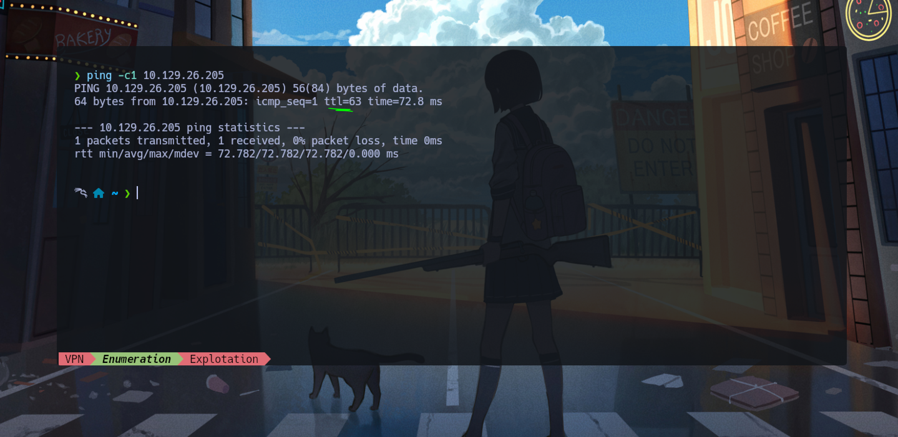

### Escaneo TCP inicial

Después hice un escaneo con Nmap para identificar puertos abiertos.

```bash
nmap -p- --open --min-rate 5000 -sS -Pn -v -n 10.10.11.244 -oN ports.txt
```

En este comando, `-p-` revisa todos los puertos TCP, `--open` muestra solo los que responden, `--min-rate 5000` fuerza un ritmo mínimo de 5000 paquetes por segundo, `-sS` realiza un SYN scan, `-Pn` evita la comprobación previa de host activo, `-v` activa salida detallada, `-n` desactiva la resolución DNS y `-oN` guarda el resultado en formato normal.

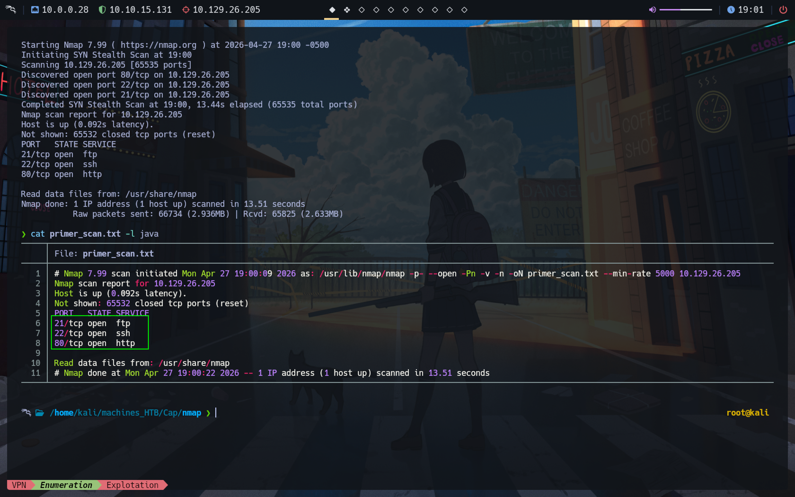

### Resultados del primer escaneo

Esta captura solo muestra la salida del escaneo, así que la dejé como evidencia del reconocimiento inicial.

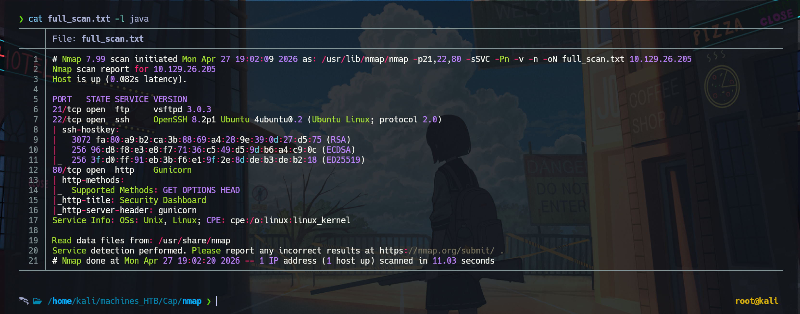

### Escaneo más profundo

Con los puertos ya identificados, ejecuté un escaneo más profundo para obtener versiones, scripts de Nmap y cualquier pista útil sobre los servicios expuestos.

```bash
nmap -p22,21,80 -sCV -Pn -v -n 10.10.11.244 -oN services.txt
```

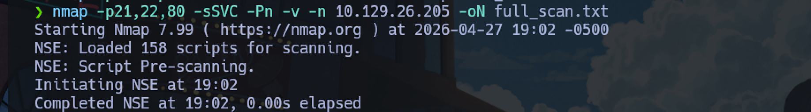

### Revisión del resultado

Aquí muestro únicamente la salida del cat sobre el escaneo.


## Enumeración

### FTP y Web

Siguiendo con la enumeración, intenté validar si el acceso anónimo por FTP estaba permitido, pero no fue posible. Después continué con `whatweb` para perfilar el servidor web.

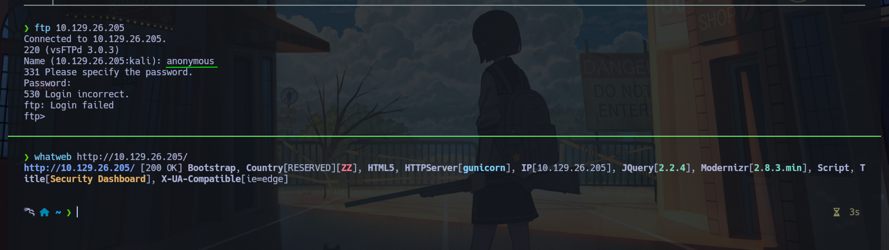

### Interfaz web principal

Desde Firefox revisé qué alojaba la aplicación y encontré una página orientada a monitoreo de red.

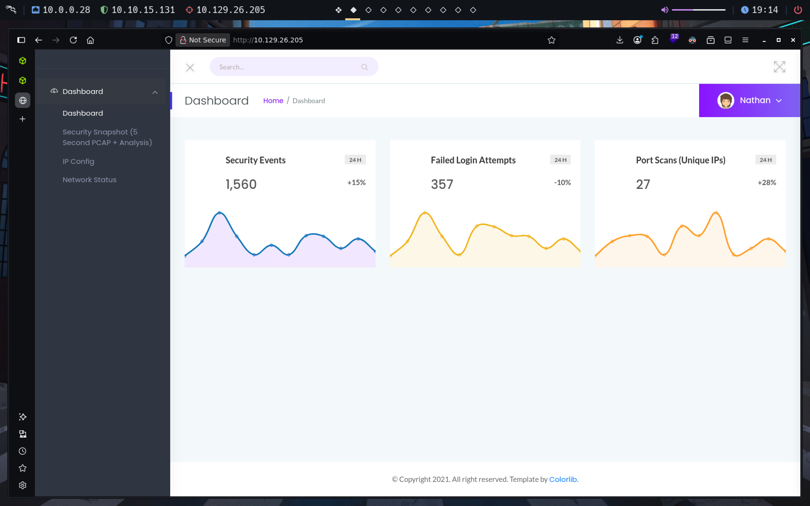

### Sección de capturas

Seguí explorando y vi que la aplicación mostraba capturas de tráfico TCP, UDP y otros datos mediante identificadores, por ejemplo `data/3`.

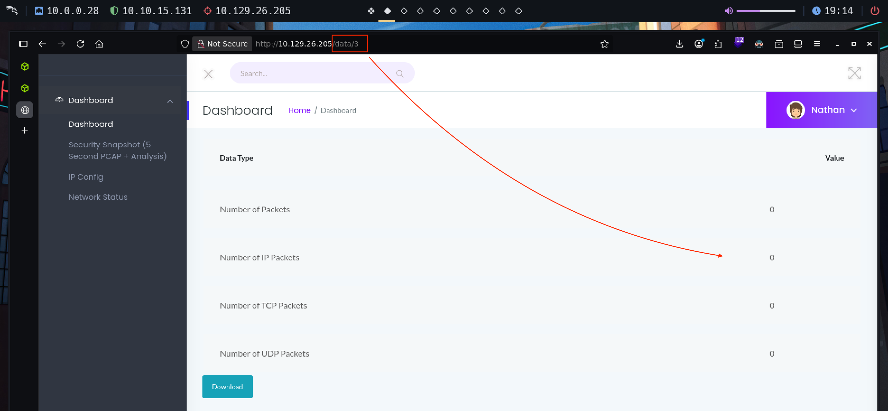

### Posible IDOR

Curioseando un poco más, probé con otro ID y noté que el `0` también devolvía una captura descargable. Eso ya apuntaba claramente a un IDOR.

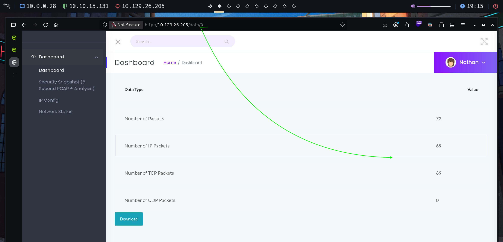

### Análisis del archivo

La descarga resultó ser un archivo `.pcap`, así que lo analicé con `tshark` para ver su contenido.

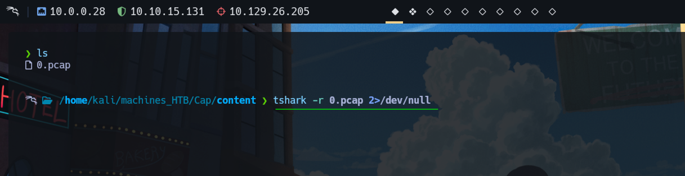

### Credenciales en claro

Dentro de la captura apareció algo muy importante: credenciales FTP en texto plano.

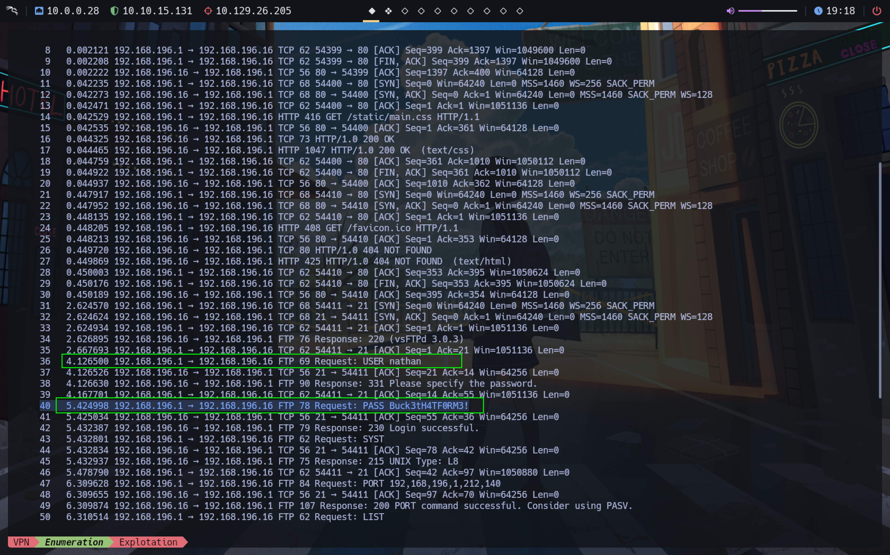

### Guardado de credenciales

Con esa información, guardé las credenciales para probarlas más adelante.


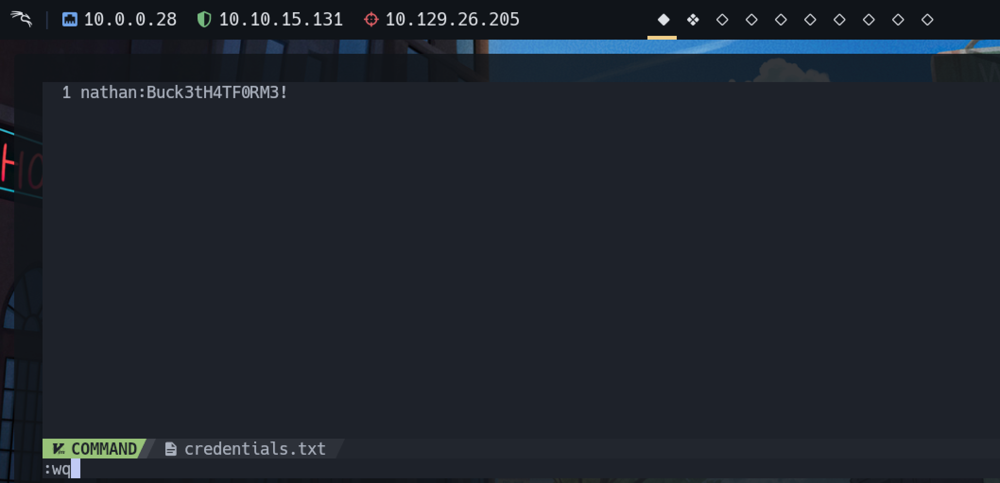

## Explotación

### Confirmación de las credenciales

Quise confirmar que funcionaran, y efectivamente pude acceder vía FTP con el usuario `nathan`. Desde ahí también encontré la flag de usuario.

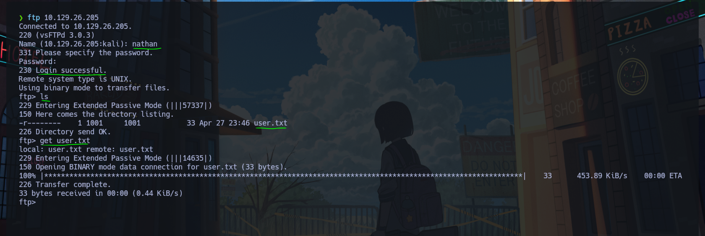

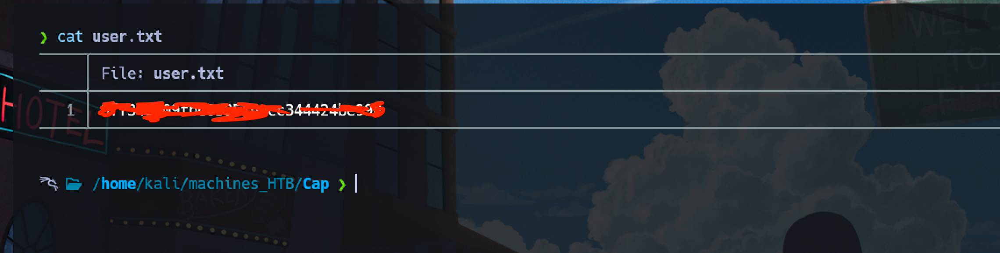

### Reutilización de contraseña

Como `nathan` no tenía acceso privilegiado, probé si reutilizaba la misma contraseña en SSH. Es un comportamiento bastante común y, en este caso, también funcionó.

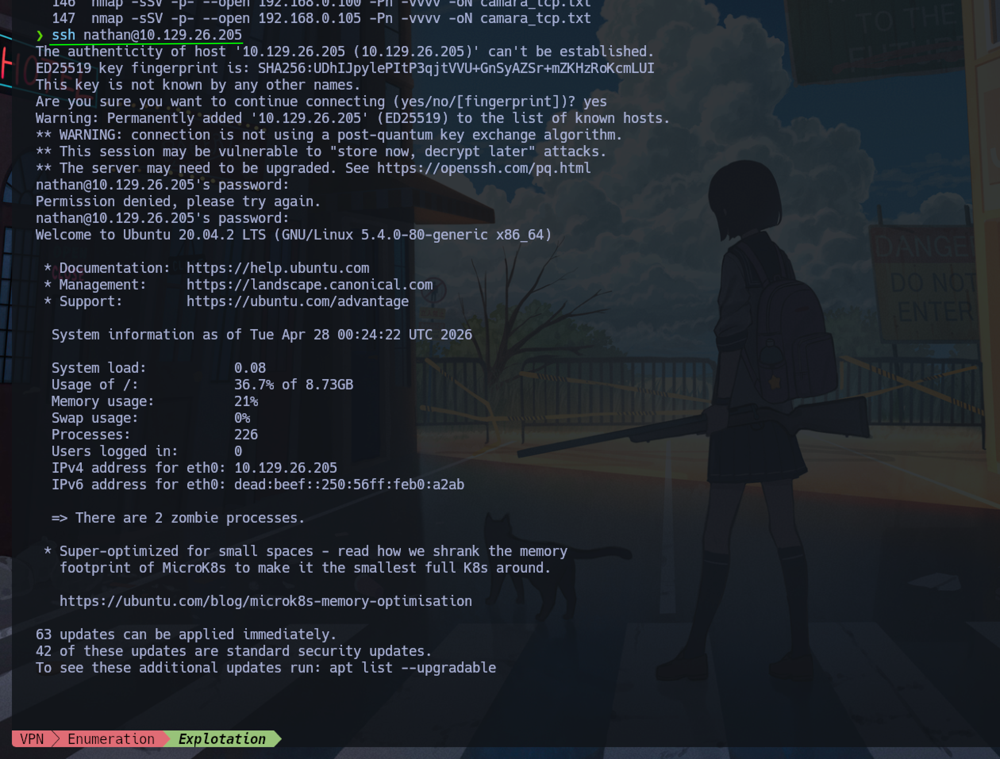

## Acceso inicial

El acceso inicial quedó resuelto con las credenciales obtenidas desde la captura de red. En la práctica, un simple IDOR fue suficiente para exponer información sensible y abrir la puerta de entrada al sistema.

## Escalada de privilegios

### Búsqueda de vectores

Ya dentro como `nathan`, revisé la raíz del sistema, permisos SUID y posibles binarios útiles para escalar privilegios, pero no encontré nada interesante por esa vía.

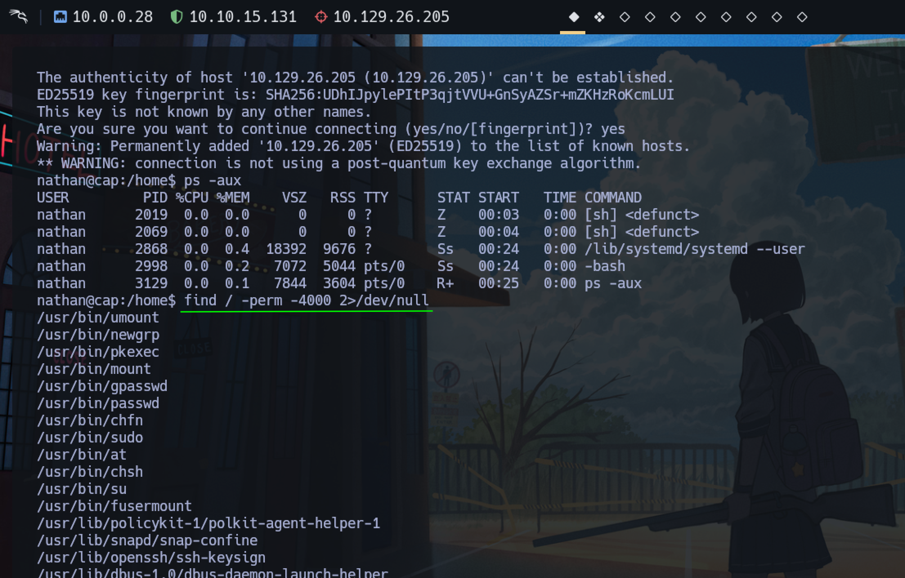

### Linux Capability mal configurada

Después busqué capabilities y encontré `cap_setuid` sobre `python3`, algo especialmente peligroso porque permite cambiar el UID del proceso.

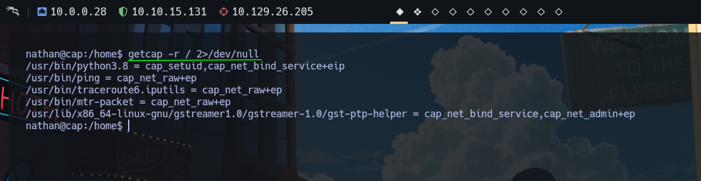

### Escalada a root

Usando Python, importé `os`, ejecuté `setuid(0)` y luego lancé una shell. Con eso la sesión quedó con UID 0, es decir, root.

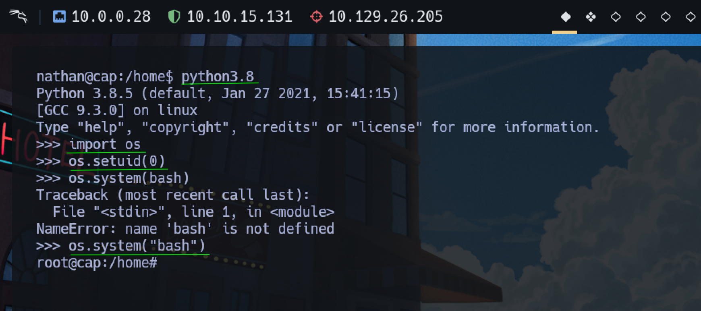

### Verificación final

Una vez obtenido root, comprobé el usuario actual y busqué la flag final para cerrar la máquina.

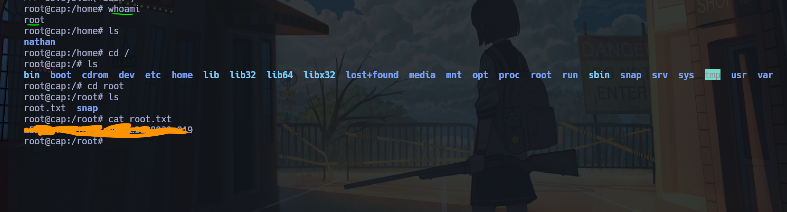

## Flags

### User flag

La flag de usuario se obtuvo tras el acceso FTP inicial con `nathan`.

### Root flag

La flag de root se obtuvo después de aprovechar la capability mal configurada en `python3`.

## Resumen

Cap fue una máquina sencilla, pero me gustó porque deja claro que un descuido pequeño, como un IDOR, puede convertirse en la puerta de entrada de un atacante al sistema. A partir de una captura de red expuesta se obtuvieron credenciales en texto plano, luego se confirmó reutilización de contraseña y finalmente una capability mal configurada permitió llegar a root.

*Write-up by estifenso | HTB Profile: 1989444 | @estifenso*
