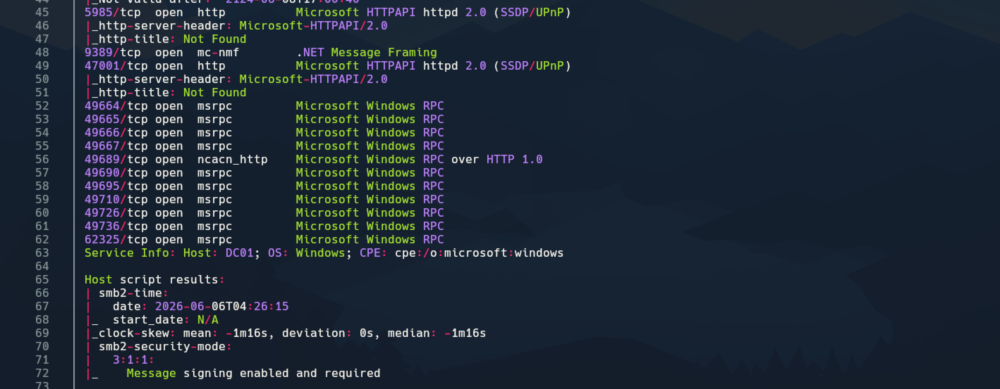
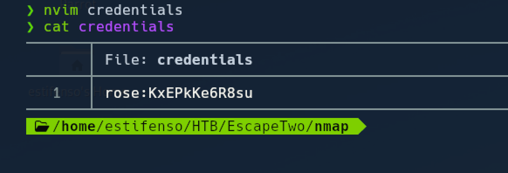
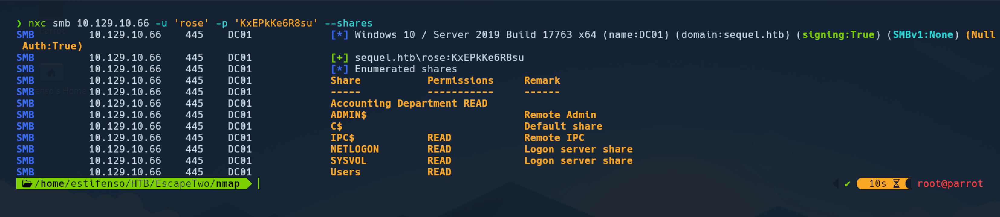
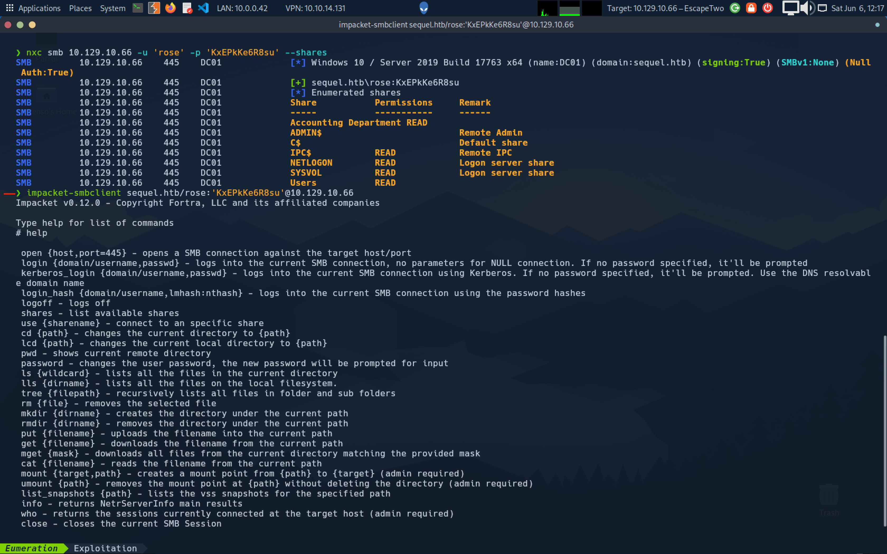
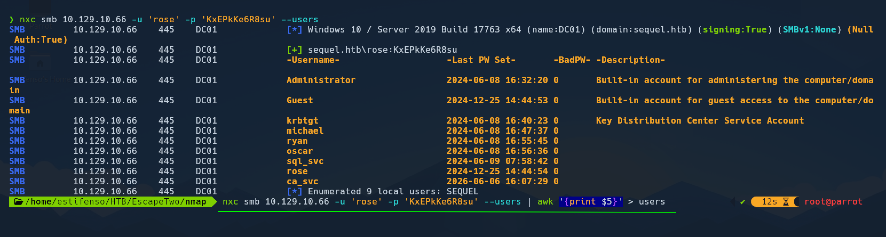
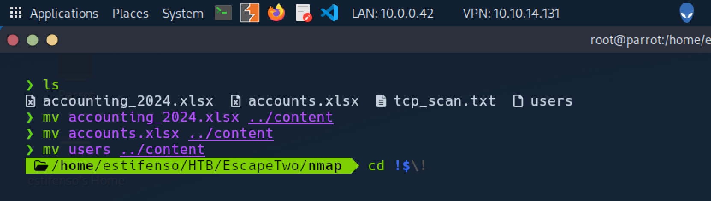
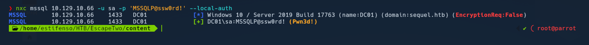
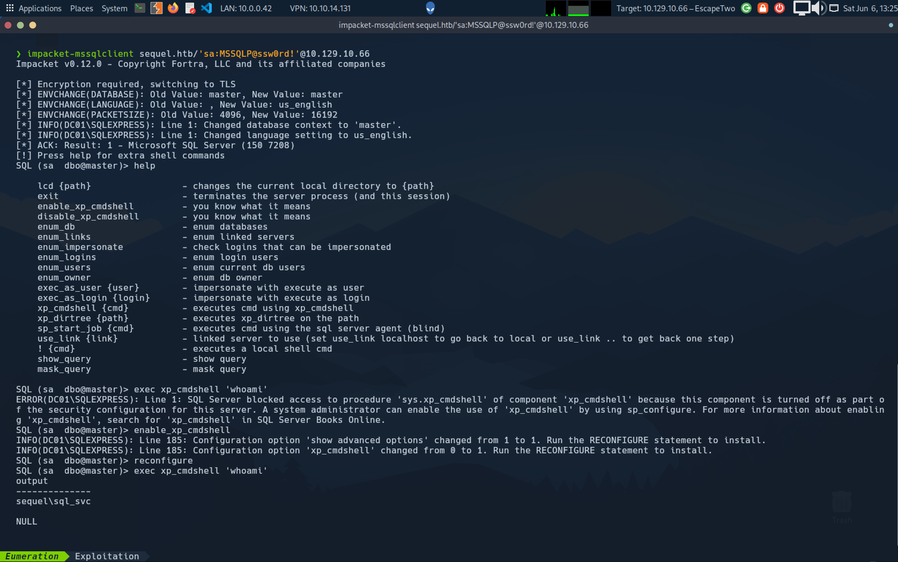
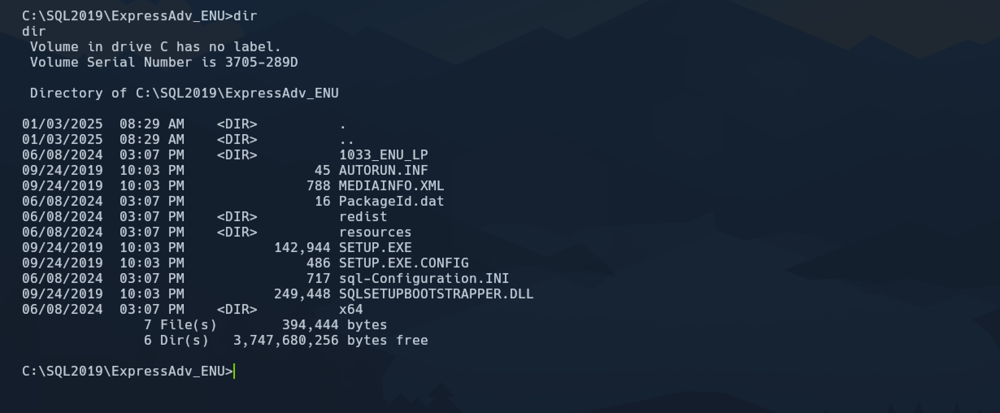

# HTB Write-Up - EscapeTwo

**Dificultad:** Easy  
**Sistema operativo:** Windows  
**Autor del writeup:** estifenso  
**Fecha:** 10 de junio de 2026

EscapeTwo es una máquina Windows de dificultad fácil enfocada en el compromiso completo de un dominio. Es una de esas máquinas que te obliga a ir paso a paso, con calma, porque cada fase va abriendo la siguiente. Yo todavía estoy aprendiendo a atacar Active Directory, y justamente por eso este tipo de labs me emocionan tanto: cada enumeración, cada credencial y cada pequeño hallazgo te enseña algo nuevo que luego puedes conectar con la siguiente pieza del rompecabezas.

La ruta fue clara, pero muy educativa. Empecé con conectividad y enumeración básica, luego encontré credenciales iniciales que me permitieron acceder a recursos compartidos. Desde ahí apareció un archivo Excel dañado que tuve que reparar para recuperar más credenciales. Con esas credenciales hice password spraying y logré acceso a MSSQL. A partir de ahí seguí enumerando el entorno y fui encontrando más piezas útiles. La parte de WinRM y ADCS la dejo para la siguiente tanda de capturas, porque todavía me la vas a ir pasando.

## Tabla de contenido

1. [Reconocimiento](#reconocimiento)
2. [Enumeración inicial](#enumeración-inicial)
3. [Credenciales y shares](#credenciales-y-shares)
4. [Archivo Excel dañado](#archivo-excel-da%C3%B1ado)
5. [Password spraying](#password-spraying)
6. [MSSQL](#mssql)
7. [Cierre](#cierre)

## Reconocimiento

### Vista inicial de la máquina

La primera captura es la foto de arranque de la máquina junto con su IP. La dejé al principio porque ubica el contexto desde el inicio y sirve como referencia rápida durante todo el write-up.

### Prueba de conectividad

Antes de tocar nada más, validé conectividad con un ping. Era la forma más rápida de confirmar que el host estaba arriba y respondiendo en red.

### Escaneo TCP inicial

Después lancé un escaneo TCP con Nmap para empezar a dibujar la superficie de ataque. Aquí la idea era identificar servicios visibles y ver si había algo que apuntara a una máquina de dominio desde el principio.

### Resultados ampliados del escaneo

En la siguiente captura se ve mejor la salida del escaneo. Este tipo de imagen ayuda a leer con más comodidad los puertos y servicios que Nmap fue encontrando.

### Indicios de Active Directory

Al revisar los puertos abiertos quedó claro que estaba frente a un entorno de Active Directory. La cantidad y variedad de servicios ya daba esa pista, así que el siguiente paso era identificar bien el dominio y el host del controlador.

### Resolución de nombre

Con esa información, añadí el dominio y el nombre del equipo a `/etc/hosts` para que la IP resolviera correctamente por DNS local. Eso me evitó problemas después al trabajar con recursos y autenticación por nombre.

## Enumeración inicial

### Credenciales iniciales desde HTB

Hack The Box nos entrega unas credenciales válidas al inicio, así que las aproveché para empezar la enumeración autenticada. En una máquina de dominio, eso cambia mucho el ritmo porque ya no dependes solo de la superficie anónima.

### Validación inicial con NetExec

Con esas credenciales probé acceso con NetExec. Primero quería confirmar que el usuario funcionaba y luego usarlo para enumerar usuarios y el entorno de forma más eficiente.

### Enumeración de shares

Después enumeré los recursos compartidos. En este punto buscaba algo útil para seguir avanzando: archivos olvidados, documentación interna o cualquier cosa que pareciera demasiado expuesta para estar ahí.

### Enumeración de usuarios con NetExec

Las credenciales que me dio HTB sí eran válidas, así que las usé para enumerar usuarios con NetExec y confirmar que el acceso inicial tenía recorrido real dentro del dominio.

### Enumeración adicional de shares

Con esa misma sesión seguí revisando shares y salida útil de la enumeración. Esta parte fue importante porque me ayudó a encontrar el archivo que luego descargué para analizarlo con más calma.

### Hallazgo interesante

Entre los shares apareció algo que sí valía la pena revisar con más calma, así que lo descargué para analizarlo localmente.

### Organización del hallazgo

Antes de abrirlo, lo dejé ordenado en mi carpeta de trabajo para no perder el hilo. En este tipo de máquinas me gusta ir guardando cada hallazgo porque luego todo se conecta.

## Archivo Excel dañado

### Identificación del formato

Lo que habíamos recuperado era material de Excel. Como estos archivos suelen estar construidos sobre XML comprimido, me fijé en su estructura interna para entender si podía leer algo sin depender de Excel.

### Lectura del contenido

Al abrir el contenido interno confirmé que el archivo estaba dañado, pero todavía era posible recuperar información útil leyendo su estructura XML. Eso ya era suficiente para seguir investigando.

### Limpieza del ruido

El XML venía lleno de ruido, así que copié lo importante y limpié el contenido para quedarme solo con lo relevante. Esa limpieza me ayudó a ver la información sensible con mucha más claridad.

### Credenciales recuperadas

Ahí apareció el primer bloque grande de credenciales. Este fue uno de los puntos más importantes de la máquina, porque a partir de aquí ya no dependía solo de adivinar, sino de cruzar usuarios y contraseñas reales.

## Password Spraying

### Cruce de usuarios y contraseñas

Con las credenciales sobre la mesa, probé el clásico cruce entre usuarios y contraseñas. La lógica es simple: a veces una contraseña funciona para otro usuario distinto, así que vale la pena probar combinaciones sin asumir nada.

### Usuario con acceso válido

En ese proceso el usuario Oscar terminó autenticando correctamente. Ese resultado me confirmó que el spray iba por el camino correcto y que las credenciales recuperadas sí tenían valor real.

### Credencial orientada a SA

También apareció la cuenta `sa`, que en Windows suele estar asociada a administración de MSSQL. Eso me abrió una ruta muy interesante porque ya no estaba tratando solo con usuarios normales.

## MSSQL

### Acceso a MSSQL con Impacket

Con la cuenta `sa` me conecté a MSSQL usando Impacket. La parte importante aquí es que ya tenía un punto de apoyo dentro del servicio de base de datos, no solo una credencial en papel.

### Uso de xp_cmdshell

Dentro de MSSQL comprobé que `xp_cmdshell` estaba disponible. Esa función es útil porque permite ejecutar comandos del sistema operativo desde SQL Server, así que se convierte en una vía directa para hacer más enumeración.

### Enumeración adicional

A partir de ahí seguí enumerando el sistema desde el contexto de MSSQL. La idea era encontrar algo que me llevara a un usuario más privilegiado o a información interna más sensible.

## Cierre

### Resultado final

EscapeTwo me gustó mucho porque junta varias cosas que me interesan especialmente ahora que estoy entrando más fuerte en Active Directory: credenciales iniciales, shares, un archivo dañado, password spraying y MSSQL en una sola ruta.

Esta primera parte del write-up solo cubre las capturas que ya te pasé. Cuando me envíes la siguiente tanda, sigo agregando las explicaciones foto por foto sin perder el hilo.

*Write-up by estifenso | HTB Profile: estifenso | 10 de junio de 2026*
