# HTB Write-Up - Titanic

**Dificultad:** Easy  
**Sistema operativo:** Linux  
**Servicios expuestos:** Apache en el puerto 80 y Gitea en un vHost adicional  
**Vulnerabilidades clave:** LFI y una versión vulnerable de ImageMagick asociada a CVE-2024-41817

Titanic es una máquina Linux de dificultad fácil. El recorrido combina enumeración web, abuso de una lectura arbitraria de archivos, extracción de credenciales desde Gitea y una escalada de privilegios apoyada en el procesamiento de imágenes por parte de un proceso privilegiado.

## Tabla de contenido

1. [Reconocimiento](#reconocimiento)
2. [Enumeración web](#enumeración-web)
3. [Gitea](#gitea)
4. [Intercepción y lectura arbitraria](#intercepción-y-lectura-arbitraria)
5. [Enumeración de Gitea](#enumeración-de-gitea)
6. [Simulación local de Gitea](#simulación-local-de-gitea)
7. [Credenciales y acceso inicial](#credenciales-y-acceso-inicial)
8. [Escalada de privilegios](#escalada-de-privilegios)
9. [Cierre](#cierre)

## Reconocimiento

### Conectividad inicial

Primero validé la conectividad con la máquina para confirmar que estaba activa antes de empezar con la enumeración.

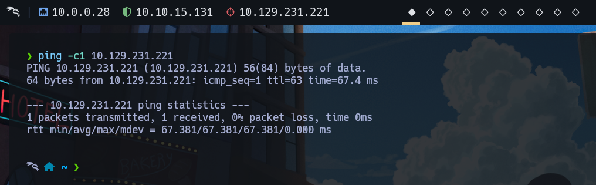

### Escaneo de puertos y servicios

Después hice un escaneo de puertos y servicios. Al ver los resultados ya me pude hacer una idea de que probablemente habría una superficie web interesante, así que preferí no adelantar conclusiones y seguir enumerando con calma.

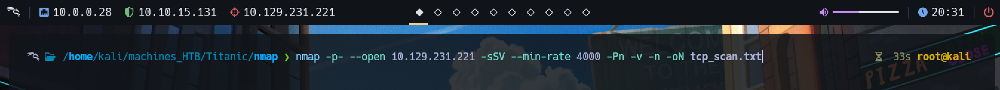

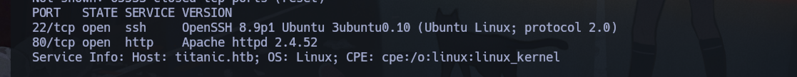

### Validación más profunda

Luego hice una revisión más profunda con los scripts de Nmap para ver si aparecía alguna vulnerabilidad evidente, pero no salió nada útil en esa fase.

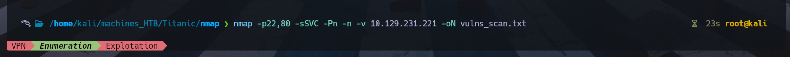

### Resolución de hostname

Como la IP resolvía a `titanic.htb`, añadí el dominio a `/etc/hosts` para trabajar el sitio directamente por nombre.

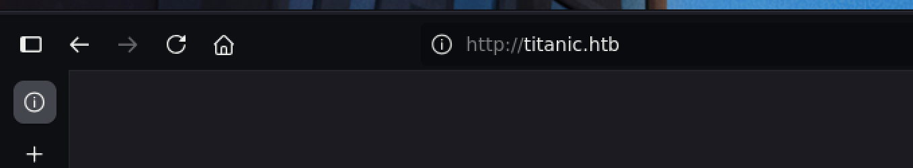

## Enumeración web

### Sitio principal

La página principal mostraba una web sencilla sobre el Titanic, sin nada particularmente llamativo a primera vista.

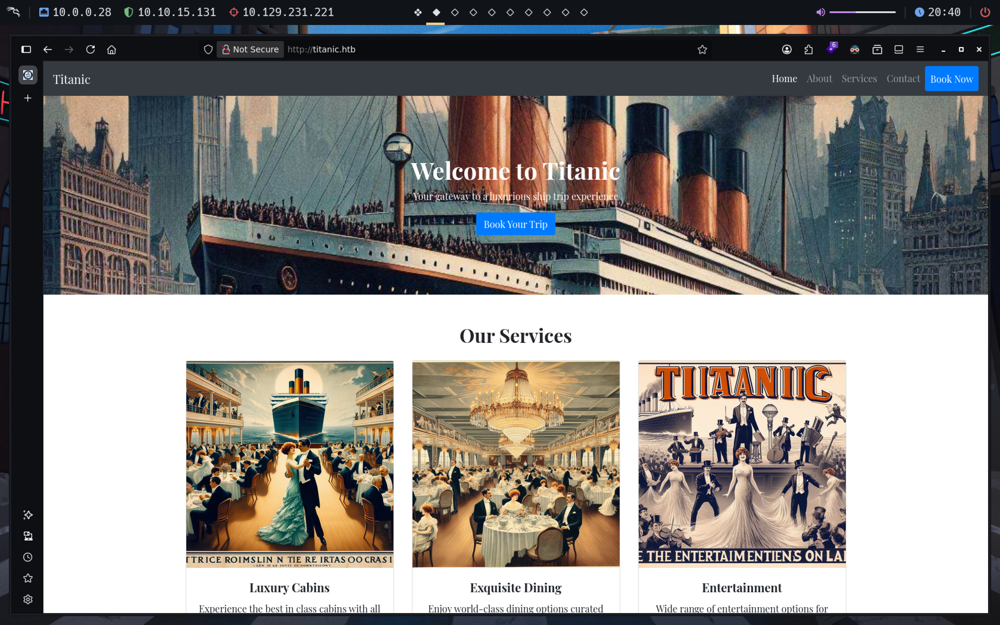

### Book Now

Al revisar la sección Book Now vi que podía reservar un viaje, por decirlo de alguna forma, y al enviar mis datos la aplicación me descargó un archivo JSON con la información que acababa de ingresar.

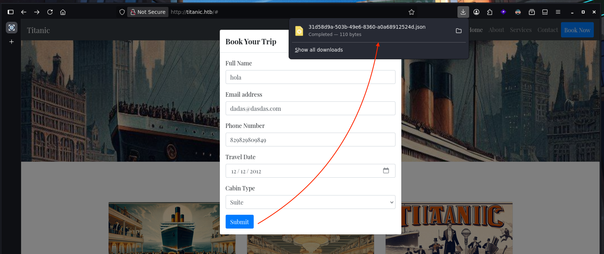

### Enumeración adicional

Seguí enumerando con feroxbuster por si encontraba algún archivo olvidado, alguna información expuesta o algo que el desarrollo hubiera dejado atrás, pero no apareció nada de valor.

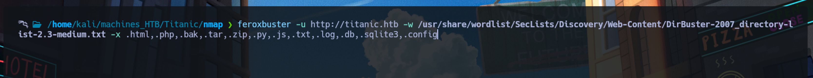

### Punto de interés

De todo lo que apareció, `/download` fue el único endpoint que me llamó un poco más la atención.

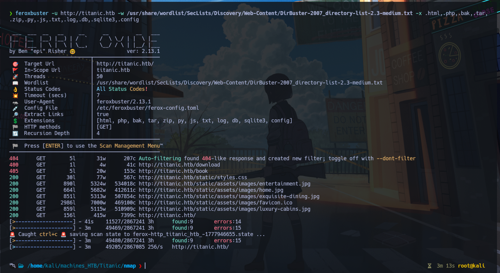

### Búsqueda de subdominios

Después seguí con la búsqueda de subdominios. Primero medí el tamaño de la respuesta con `curl` para luego filtrar mejor con `wfuzz` y ver qué aparecía.

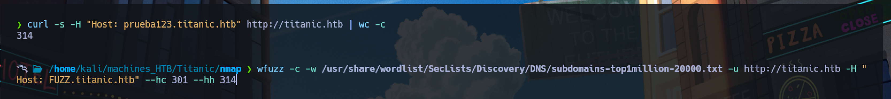

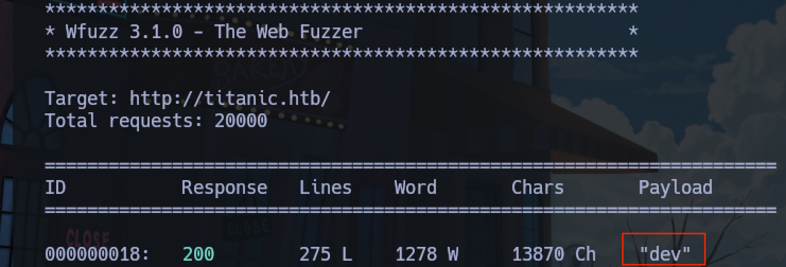

## Gitea

### Primer hallazgo

Cuando llegué a `dev.titanic.htb` me encontré con Gitea. No lo conocía, así que primero lo busqué en Google para entender qué estaba viendo.

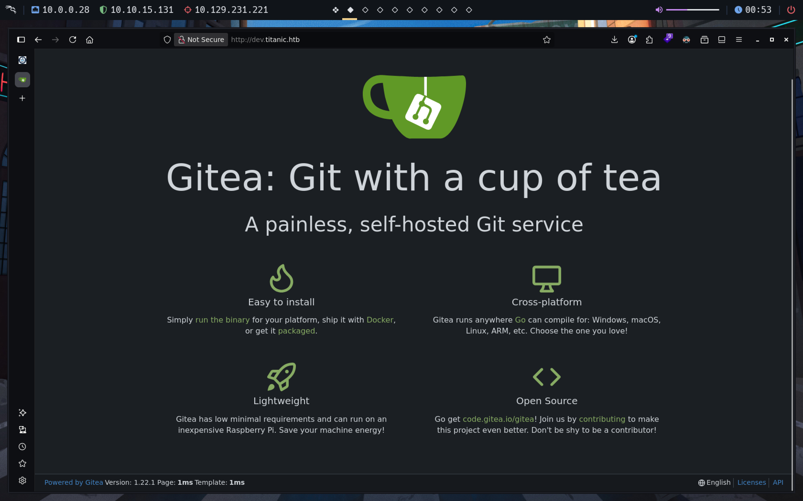

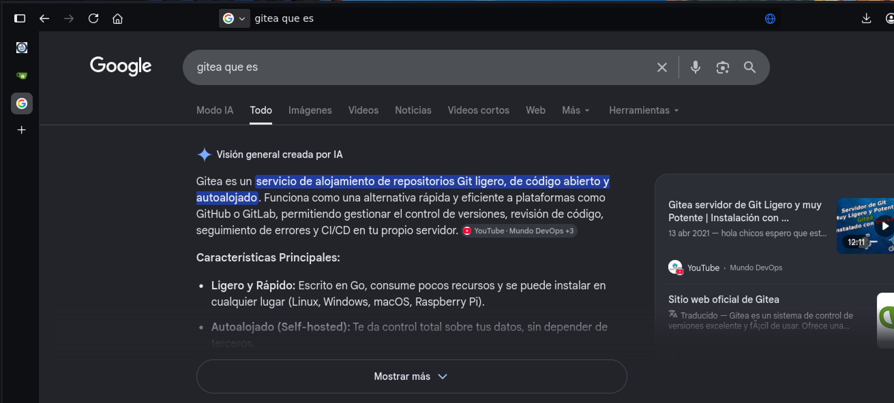

### Pruebas iniciales

En ese punto me registré para explorar qué podía publicar, buscar o enumerar dentro de la plataforma. También me pasó por la cabeza probar si podía subir algún archivo y forzar una reverse shell vía PHP, pero ese intento no me dio resultados.

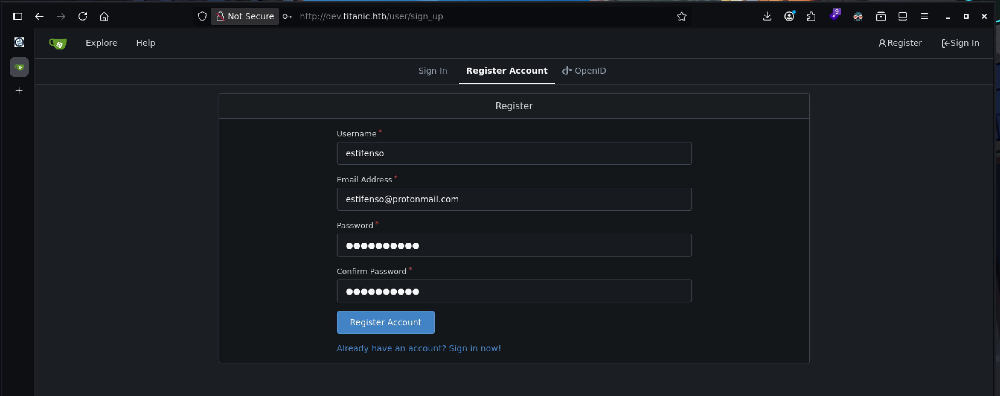

## Intercepción y lectura arbitraria

### Burp Suite

Antes de seguir, abrí Burp Suite porque pensé que, si la aplicación descargaba un JSON, quizá el flujo aceptaba cambiar la ruta de descarga por otra cosa útil.

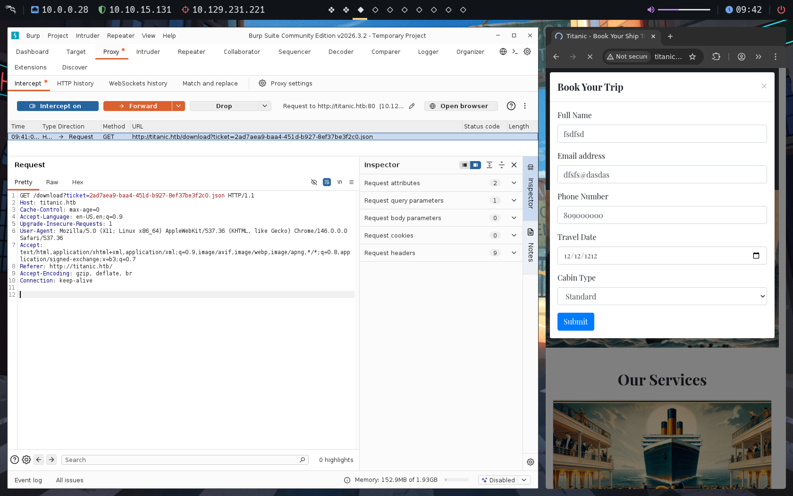

### Manipulación del parámetro

Probé a cambiar el archivo JSON esperado por `/etc/passwd` para verificar si el parámetro permitía leer archivos arbitrarios.

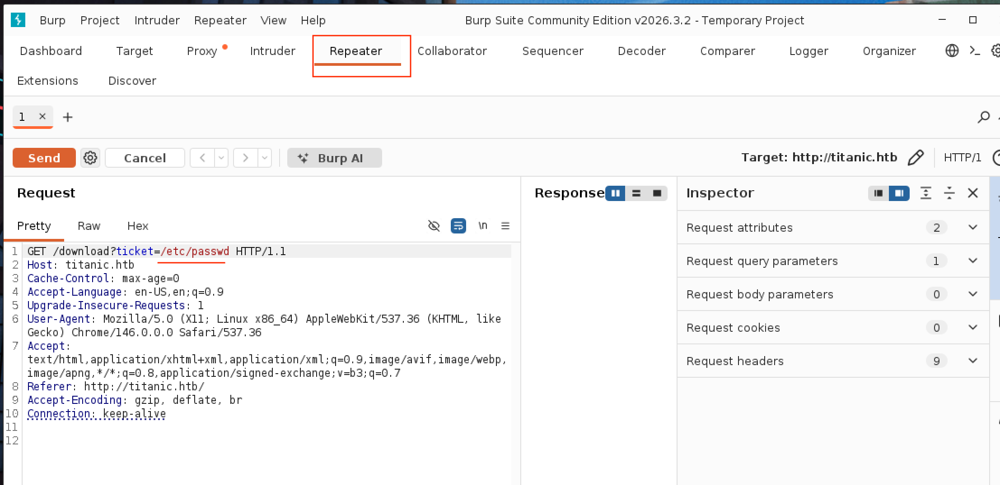

### Confirmación de la LFI

La aplicación me devolvió el contenido de `/etc/passwd`, así que confirmé la lectura arbitraria de archivos y, de paso, identifiqué al usuario `developer`, que tenía una shell válida.

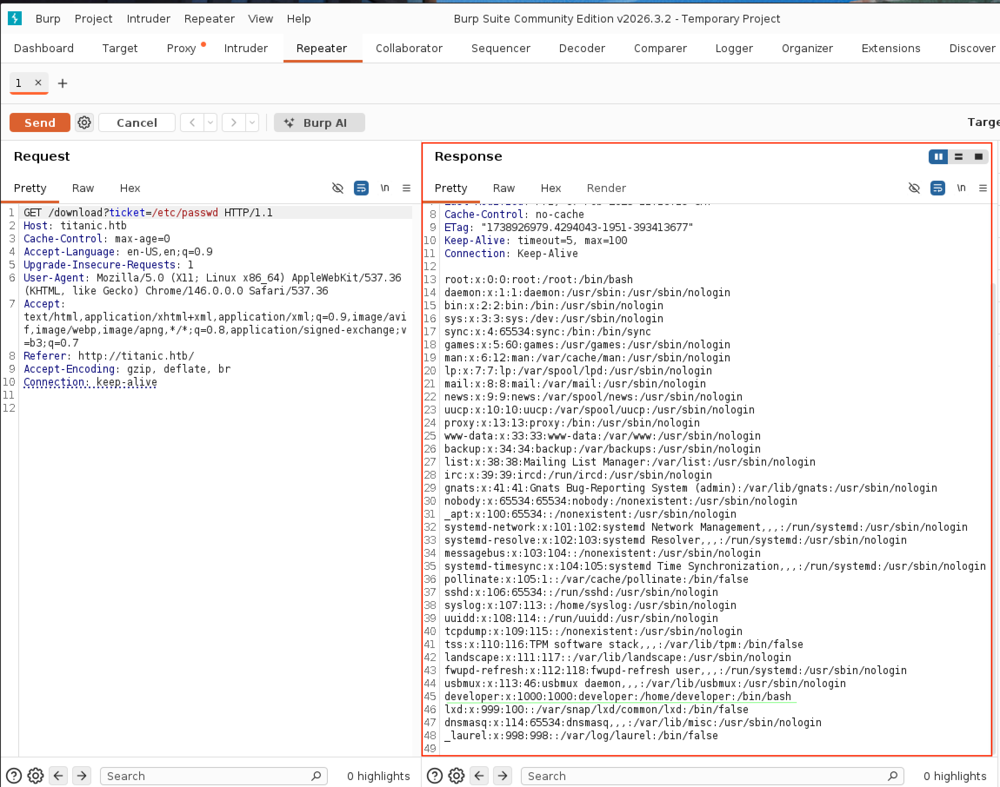

## Enumeración de Gitea

### Repositorios del usuario developer

Volví a Gitea y vi que el usuario `developer` tenía varios repositorios. Uno de ellos, `docker-config`, contenía dos aplicaciones, `mysql` y `gitea`, ambas preparadas para desplegar en Docker con sus archivos `docker-compose.yml` expuestos.

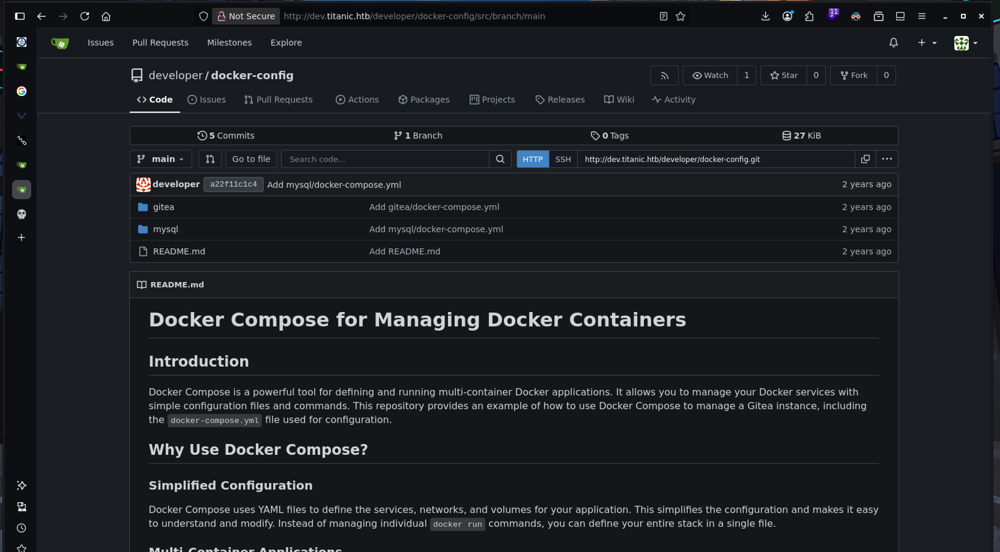

### Extracción de credenciales

Al revisar esos archivos pude extraer credenciales de la base de datos, usuarios y otros datos sensibles que más adelante me ayudarían a seguir enumerando.

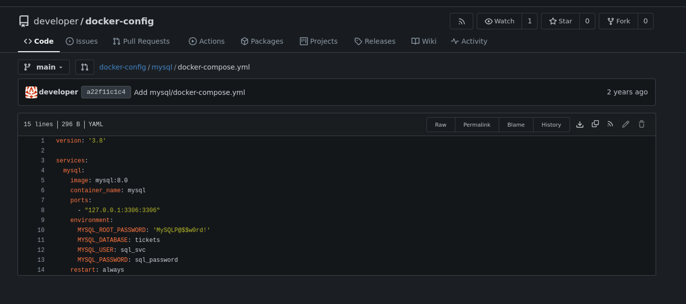

### Validación de credenciales

Me cloné los repositorios y fui probando con lo que había encontrado. Incluso con acceso a la base de datos no encontré nada especialmente útil en ese momento.

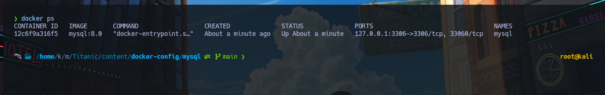

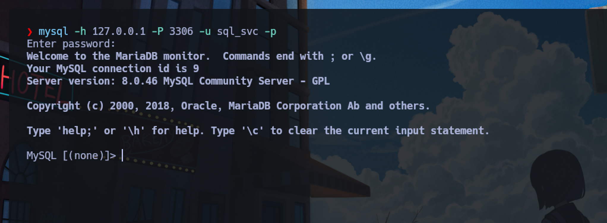

## Simulación local de Gitea

### Volumen de datos

En la aplicación de Gitea vi la ruta `/home/developer/gitea/data:/data`, que es la que usa la aplicación para guardar información crítica como repositorios, configuraciones y bases internas.

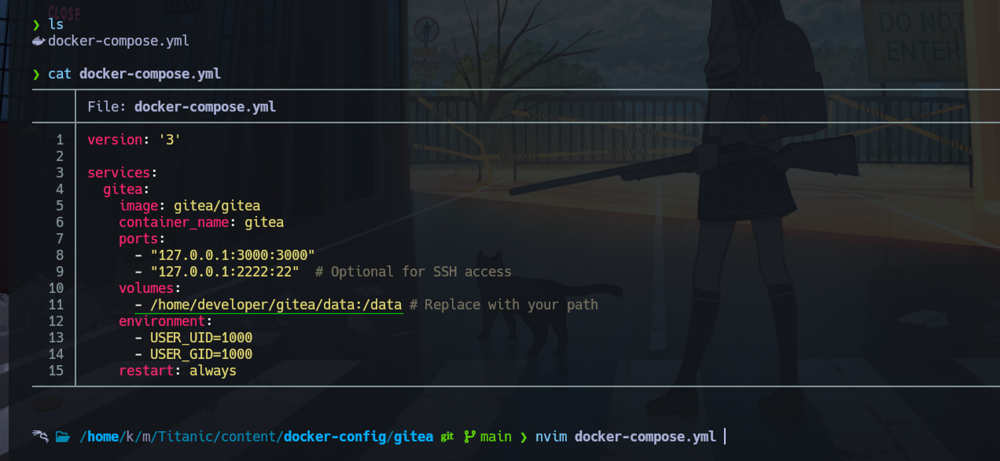

### Ajuste del entorno local

Para entender mejor cómo funcionaba la aplicación, cambié esa ruta por una local y pude guardar todo ahí para analizarlo con más comodidad.

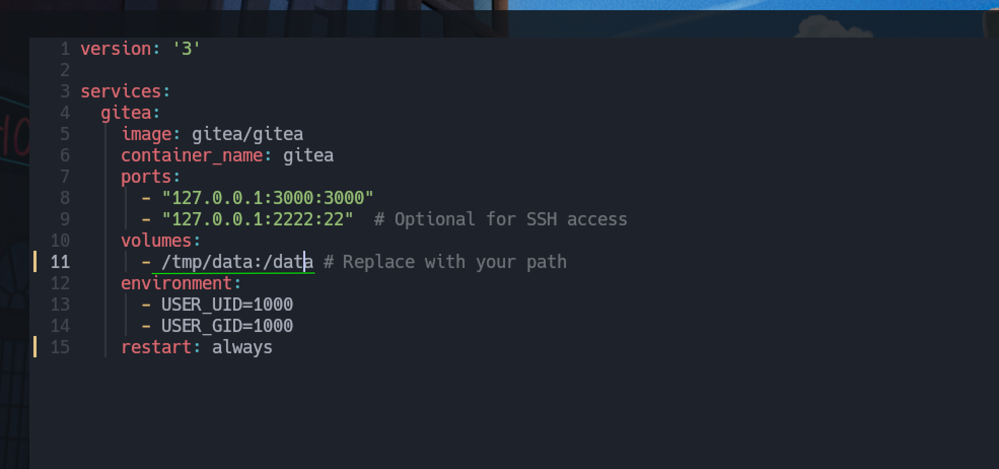

### Levantamiento del contenedor

Con esa modificación levanté el `docker-compose` y la aplicación quedó corriendo en `127.0.0.1:3000`.

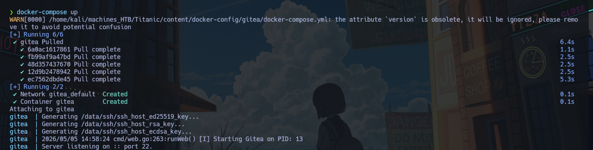

### Instalación por defecto

Dejé la configuración por defecto e instalé la instancia local.

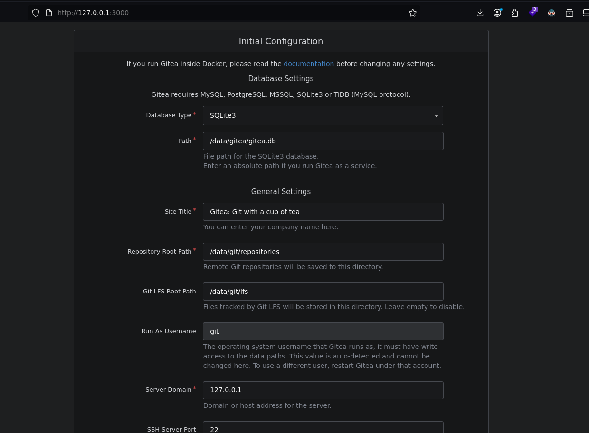

### Validación de la ruta interna

En la ruta que agregué, `/tmp/data`, pude ver que Gitea guardaba una base de datos. Como estaba en Docker, esto me sirvió como simulación para entender la aplicación en producción y evaluar si ese mismo dato podía leerse desde la instancia real.

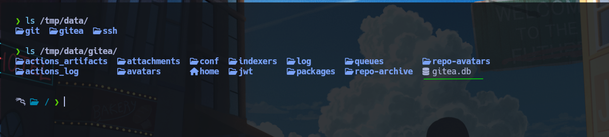

### Descarga de la base de datos

Con esa hipótesis, probé a descargar la base de datos desde la aplicación real y efectivamente lo logré.

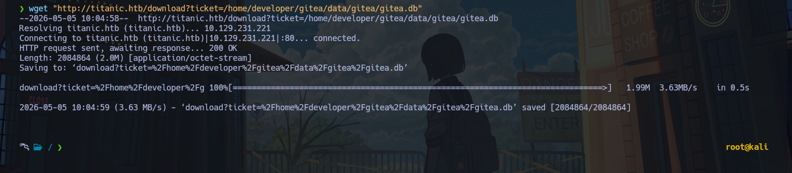

## Credenciales y acceso inicial

### Consulta de usuarios

Con `sqlite3` consulté la tabla `user`, que contenía los usuarios y sus contraseñas hasheadas.

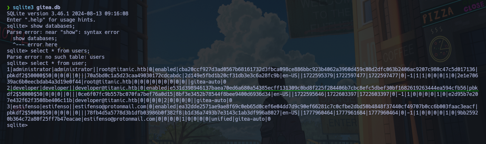

### Crackeo del hash

Luego crackeé el hash con `hashcat` y `rockyou`.

### Reutilización de credenciales

Me enfoqué en `developer`, porque era el único usuario del sistema con una shell válida, y dejé sus credenciales a mano para seguir con la prueba.

Luego comprobé si esa misma contraseña servía para SSH.

La clave también funcionó por SSH y así obtuve acceso al sistema como `developer`, con lo que pude capturar la primera flag, `user.txt`.

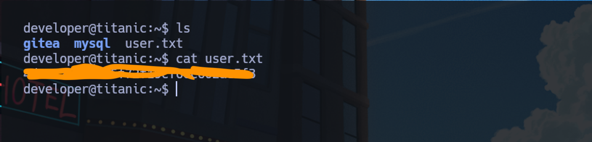

## Escalada de privilegios

### Enumeración local

Ya dentro como usuario de bajos privilegios, empecé la enumeración local en busca de una ruta directa hacia `root`. Como no había otras cuentas aprovechables para movimiento lateral, el objetivo era una escalada local.

Durante la revisión de permisos encontré que la ruta `/opt/app/static/assets/images` tenía permisos `770`, lo que permitía lectura, escritura y ejecución al grupo `developer`, al que pertenecía mi usuario.

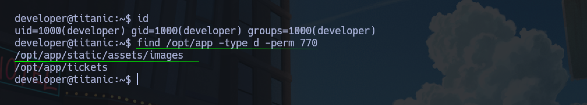

### Proceso automatizado

Al revisar el contenido observé varias imágenes `.jpg` y también `metadata.log`. Ese archivo llamó la atención porque parecía actualizarse de forma periódica.

Más adelante encontré el script `/opt/scripts/identify_images.sh`, que procesaba esas imágenes con `magick identify` y redirigía la salida hacia `metadata.log`.

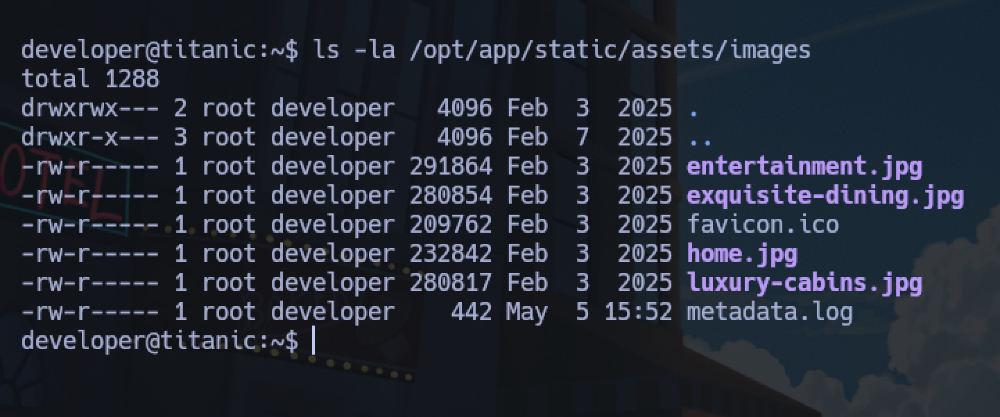

Ese comportamiento me confirmó que había un proceso automatizado, muy probablemente ejecutado como `root`, interactuando con un directorio donde yo podía escribir.

### Payload

Aprovechando ese escenario, preparé un payload en C para que, al ser cargado por el proceso, creara una shell con privilegios elevados.

La idea era copiar `/bin/sh` a `/tmp/sh` y asignarle el bit SUID para poder reutilizarlo después con privilegios de `root`.

Compilé el payload como una librería compartida llamada `libxcb.so.1` y la coloqué dentro del directorio de imágenes.

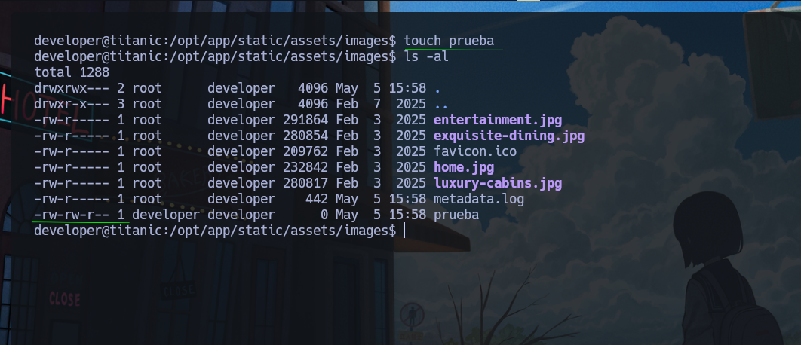

### Ajuste final

No desarrollé el exploit desde cero; me apoyé en ayuda externa para generarlo y luego lo adapté al contexto exacto de la máquina.

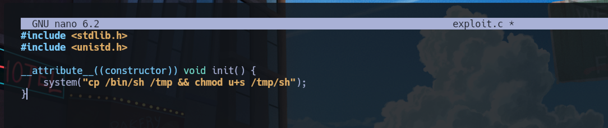

Una vez ubicado el payload, solo quedaba esperar a que el proceso automatizado lo ejecutara.

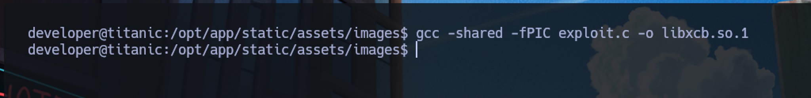

Al listar `/tmp` confirmé que la shell creada tenía el bit SUID activado.

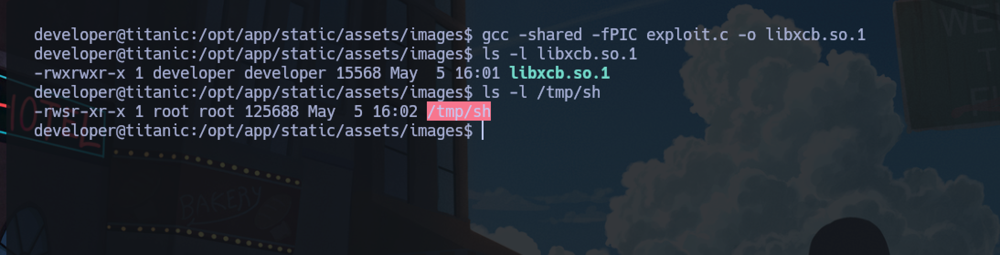

Con eso ejecuté `/tmp/sh -p`. El parámetro `-p` preserva los privilegios efectivos del binario y evita que la shell descarte el contexto SUID.

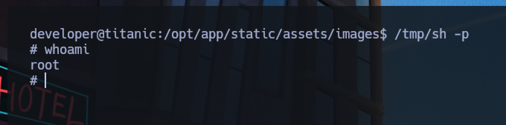

El resultado fue una shell como `root`, cerrando la máquina y permitiendo capturar `root.txt`.

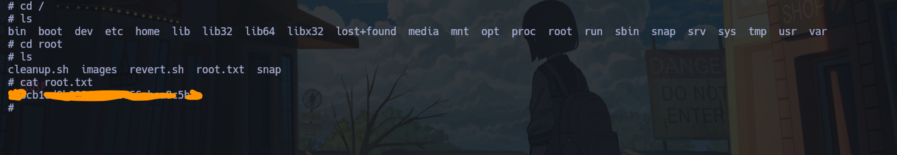

## Cierre

Titanic combina una enumeración web bastante directa con una LFI que termina siendo la llave para sacar credenciales y entrar al entorno de Gitea. A partir de ahí, la escalada se apoya en un proceso privilegiado que trabaja sobre un directorio escribible, lo que abre la puerta a la explotación basada en ImageMagick y a la ejecución de código como `root`.
